**1. MFA - DELETE**
-MFA (multi-factor authentication) forces user to generate a code on a device (usually a mobile phone or hardware) before doing important operations on S3
 xác thực đa nhân tố bắt buộc người dùng để tạo ra mã trên 1 thiết bị (thông thương là điện thoại hoặc phần cứng) trước thực hiện các hoạt động quan trọng trong s3
- To use MFA-Delete, enable Versioning on the S3 bucket: để sử dụng MFA-Delete, cho phép đánh phiên bản trên s3 bucket
- You will need MFA to 
  - permanently delete an object version: xóa vĩnh viễn 1 phiên bản object
  - suspend versioning on the bucket: đình chỉ đánh phiên bản trên s3 bucket
- You won't need MFA for:
  - enable versioning
  - list deleted versions
- Only the bucket owner (root account) can enable/disable MFA-Delete: chỉ chủ sở hữu bucket(root account) có thể cho phép/vô hiệu hóa MFA-DELETE
- MFA Delete currently can only be enabled by using the CLI: xóa sử dụng MFA hiện tại chỉ có thể kích hoạt bằng cách sử dụng CLI

**2. Default Encryption vs Bucket Polices**
- One way to "force encryption" is to use a bucket policy and refuse any API call to PUT an S3 object without encryption headers
  Một cách để bắt buộc mã hóa là sử dụng pucket policy và từ chối bắt kỳ  API gọi đến PUT 1 S3 object không có encryption headers
- Another way is to use the "default encryption" option in s3
 Cách khác là sử dụng mặc lựa chọn định mã hóa trong s3
- Note: Bucket policies are process evaluated before "default encryption"
  Bucket policies thực hiện phỏng đoán trước 'defautl encryption' 

**3. Access logs**

- For audit purpose, you may want to log all access to s3 buckets
- any request made to s3 from any account, authorized or denied, will be logged into another s3 bucket: bất kể yêu cầu được tạo ra đến S3, từ bất kể tài khoản nào, được ủy quyền hoặc bị từ chối, đều được ghi vào trong S3 bucket khác
- S3 Access logs log all the requests made to S3 buckets and Amazon Athena can then be used to run serverless analytics on top of the logs
  S3 Access logs ghi lại tất cả các yêu cầu tạo ra đến s3 buckets và Amazon Athena sau đó có thể được sử dụng để phân tích  không có máy chủ trên đầu của nhật ký
_3.1 Access logs: Warning_

- Do not set your logging bucket to be the monitored bucket:Không đặt logs bucket vào nhóm bucket được theo dõi
- It will create a logging loop, and your bucket will grow in the size exponentially: Nó sẽ tạo ra những vòng log, và kích thước bucket của bạn sẽ tăng lên theo cấp số nhân

**4. Replication (CRR - SRR)**
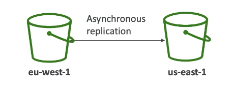
- S3 Replication allows you to replicate data from an S3 bucket to another in the same/different AWS Region.
- CRR: Cross Region Replication 
- SRR: Same Region Replication
- Must enable versioning in source and destination: phải cho phép đánh phiên bản trên tài nguyên và bucket đích đến
- Buckets can be in different account
- Copying is asynchronous
- You must provide IAM permission to S3 to do the replication: bạn phải cung cấp IAM permisson đến S3 để cho sao chép
- CRR - Use case: compliance, lower latency access, replications across accounts: sự tuân thủ, truy cập với độ trễ thấp, nhân rộng xuyên qua tài khoản
- SRR - Use Case: log aggregation across multiple accounts, live replication between production accounts and test accounts or disaster recovery
 tập hợp nhật ký trên nhiều tài khoản, sao chép trực tiếp giữa tài khoản production và tài khoản test hoặc để khắc phục sự cố
- Version ID of "source bucket" always same Version ID of "replica bucket"
**NOTE**
- After enable Replication, only the new objects in your bucket are going to be replicated:
 Sau khi cho phép nhân rộng, chỉ các objects mới trong bucket của bạn mới được sao chép
- Optionally, you can replicate existing object by using S3 Batch Replication: tùy chọn, bạn có thể sao chép các object đã tồn tại  bằng cách sử dụng S3 Batch Replication
  - Replications existing objects and objects that failed replication: Sao chéo các object đã tồn tại và objects sao chép lỗi
- For Delete operations:
  - delete marker are NOT replicaed  BY DEFAULT
  - can replicate delete marker from source to target (optional setting): có thể sao chép "đánh dấu xóa" từ nguồn đến mục tiêu (tùy chọn)
  - Deletions with version ID are no replicated (to avoid malicious deletes): sự xóa bỏ với version ID không được sao chép (để tránh xóa độc hại)
- NO "chaining" of replication : không sâu chuỗi replon
  - if "bucket1" has replication into "bucket 2" and "bucket 2" has replication into "bucket 3"
  - then the objects of "bucket1" are NOT going to be replication to "bucket3"

**5. S3 pre-signed URLs: URLs được ký trước**
- Can generate pre-signed URLs using SDK or CLI
  - For downloads (easy, can be use the CLI)
  - For upload (harder, must use the SDK)
- valid for default of "S3 pre-signed URLs" is 3600 seconds, can change time with [--expires-in TIME_BY_SECONDS], argument
 giá trị cho mặc định của "S3 pre-signed URLs" là 3600s(1hour), có thể thay đổi thời gian vơi
- Users given a per-signed URL inherit the permission of the person who generated the URL for GET/POST
 Users nhận được "per-signed URL" kế thừa các quyền của người, họ đã tạo ra "per-signed URL" cho phương thức GET/POST
- When Use Pre-siged: Anyone can access the objects with the pre-signed URL until it expires, even if the bucket and object are private:
 Bất cứ ai đều có thể truy cập object với "pre-signed URL" cho đến khi nó hết hạn. ngay cả khi bucket vaf object là riêng tư
- Exmaples: 
  - Allow only logged-in users to download a premium video on your s3 bucket:
  Chỉ cho phép người dùng đã đăng nhập để tải xuống 1 premium video trên s3 bucket của bạn
  - You have an every changing list  of users. If you want download list users to files.So you could go to generate URLs dynamically to download
  bạn có 1 danh sách người dùng luôn thay đổi. Nếu bạn muốn tải xuống file danh sách người dùng. Bạn có thể tạo URLs động để tải xuống nó
  - Allow temporary a user to upload a file to precise location in the bucket. (E.g you want to allow a user upload a picture directly onto our S3 bucket)"
  cho phép người dùng tạm thời để tải file lên địa điểm chính xác trong bucket. (ví dụ bạn muốn cho phép người dùng tải 1 ảnh trực tiếp lên trên s3 bucket của họ)

**6. S3 Storage Class + Glacier**

_6.1 S3 Storage Class_
- Amazon S3 - standard - General Purpose
- Amazon S3 - Standard - Infrequent Access (IA): truy cập không thường xuyên
- Amazon S3 - One Zone Infrequent Access: truy cập không thường xuyên trên 1 khu vực
- Amazon S3 - Glacier Instant Retrieval: Glacier lấy lại (phục hồi) ngay lập tức
- Amazon S3 - Glacier Flexible Retrieval: Glacier lấy lại (phục hồi) linh hoạt
- Amazon S3 - Glacier Deep Archive: Glacier lưu trữ sâu
- Amazon S3 - Intelligent tiering: Phân cấp thông minh
- can move object between storage classes manually or using s3 lifecycle configurations: có thể chuyển object giữa các storage-class - thủ công hoặc sử dụng s3 vòng đời cấu hình 

_6.2 Durability and Availability: Độ bền và tính khả dụng_
- Durability:
  - Durability represent how many times objects is going to be lost by Amazon S3: Durability đại diện cho số object bị mất đi trên s3
  - High durability (99.999999999%) of objects across multiple AZ
  - if you store 10,000,000 objects with Amazon S3, you can on average expect to lose of a single object once every 10,000 year
  Nếu bạn lưu trữ 10,000,000 objects với Amazon S3. bạn có thể mong chờ trung bình để mất đi mỗi 1 object là 10,000 năm
  - Durability for same all storage-classes in s3: Durability này tương tự cho tất cả storage-classes trong s3

- Availability:
  - Measures how readily available a service: đo lường mức độ có sẵn của 1 dịch vụ
  - Availability depending on storage-class: tính khả dụng phụ thuộc trên storage-class
  - Example: S3 standard has 99.99% availability = not available 53 minutes/year

_6.3 Amazon S3 standard - General Purpose_

- 99.99% availability 
- used for Frequent Accessed data: sử dụng cho dữ liệu Truy cập thường xuyên
- low latency and high throughput: độ trễ thấp và thông lượng truy cập cao
- availability sustain two concurrent facility failures: availability duy trì đồng thời 2  "thuận tiện" và "thất bại"
- Use case: 
  - Big data analytic, mobile & gaming application, content distribution

_6.4 Amazon S3 standard - Infrequent Accessed_
- For data that is less infrequent accessed, but required rapid access when needed: Cho dữ liệu được truy cập không thường xuyên. nhưng yêu cầu phải truy cập nhanh khi cần
- lower cost than "S3 standard General Purpose": chi phí thấp hơn "S3 standard General Purpose"

- _Amazon S3 standard - Infrequent Access_:
  
  - 99.99% availability
  - use case: disaster recovery, backups
    
- _Amazon S3 standard - One Zone Infrequent Access_:
    
  - High durability (99.99999999%) in a single AZ; data lost when AZ is destroyed
  - 99.5% availability
  - Use case: Storing secondary backup copies of on-premise data, or data you can recreate: 
  sử dụng lưu trữ "bản sao lưu thứ cấp" sao chép của cở sở dữ liệu hoặc dữ liệu cần tạo mới lại

_6.5 Amazon S3 Glacier Storage Classes_
- Low cost object storage meant for archiving/backup: chi phí thấp, để cho lưu chữ và sao lưu
- Pricing: Price of storage + object retrieval cost

- _Amazon S3 - Glacier Instant Retrieval:_
  
  - Milliseconds retrieval, great for data accessed once a quarter: phục hồi trong mini giây, tuyệt vời cho data truy cập 1 lần 1 Quý (quý của năm)
  - Minimum storage duration of 90 days: Khoảng thời gian lưu trữ tối thiêu là 90 ngày
  - Moving objects to "Storage classes" can be done manually: DI chuyển object đếm "các lớp kho lưu trữ" có thể hoàn thành bằng tay
- _Amazon S3 - Glacier Flexible Retrieval:_
    
  - Amazon S3 - Glacier Flexible Retrieval means you have expedited go to where you back data between  1 -> 5 minutes
    Amazon S3 - Glacier Flexible Retrieval có nghĩa là bạn nhanh chóng đến nơi để lấy lại dữ liệu trong vòng 1 phí đến 5 phút
  - Expedited (1 to 5 minutes), Standard (3 -> 5 hour), Bulk (5 -> 12 hour) => FREE
  - Minimum storage duration of 90 days: Khoảng thời gian lưu trữ tối thiêu là 90 ngày

- _Amazon S3 - Glacier Deep Archive:_
  
  - Standard (12 hour), Bulk (48 hour)
  - Minimum storage duration of 180 days: Khoảng thời gian lưu trữ tối thiêu là 180 ngày
  - lowest cost

_6.5 Amazon S3 - Intelligent tiering_

- you are going to incur a small monthly monitoring and a small auto-tiering fee: bạn phải gánh chịu 1 khoảng phí nhỏ để giám sát hàng tháng và 1 khoản phí để tự động phân tầng
- move object automatically between access tiers based on usage: tự động di chuyển object giữa các tầng truy cập, dựa trên việc sử dụng
- No retrieval fee in S3 intelligent-Tiering: không tốn chi phí phục hồi (lấy lại) trong S3 - Intelligent tiering
- Frequent Access tier (auto matic): default tier  
- Infrequent Access tier (auto matic): objects not accessed for 30 days
- Archive Instant Access tier (auto matic): objects not accessed for 90 days
- Archive Access tier (optional): objects not accessed for 90 days -> 700+ days
- Deep Archive Access tier (optional): objects not accessed for 180 days -> 700+ days

**7. S3 Lifecycle rules**

_7.1 Moving objects between storage classes_

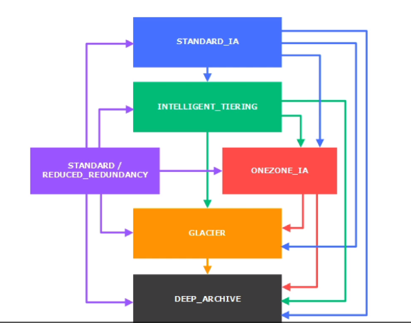
- You can transition objects between storage classes
- For infrequently accessed object, move them to STANDARD_IA
- For archive objects you don't need in real-time, GLACIER or DEEP_ARCHIVE. Because when moving objects to "Storage classes" can be done manually 
- For archive objects can be automated using lifecycle configuration

_7.1 S3 Lifecycle Rule_
- Transition actions: it defines when objects are transitioned to another storage class :
  Hoạt động chuyển giao, nó quy định khi nào objects được vận chuyển đến 1 lớp lưu trữ khác
  - Move objects to Standard-IA class 60 days After creation
  - Move objects to Glacier for archiving after 6 months
- Expiration actions: Hoạt động hết hạn
  - Configure object to expire after some time DELETED: cấu hình object hết hạn sau 1 khoảng thời bị xóa
  - Example: you have access log files can be set delete after a 365 days: bạn có các file nhật ký truy cập có thể bị xóa sau 365 ngày
  - Can be used to deleted old versions of files (if versioning enable)
  - can be used to delete incomplete multi-path uploads: có thể sử dụng để xóa các multi-part uploads chưa hoàn chỉnh
    - Example: case some parts upload are hanging around for 30 year and you will never complete it. Then you need setup Expiration Action for remove there parts:
    Ví dụ: trường hợp tải lên nhiều phần nó đang bị treo khoảng 30 năm và bạn biết nó sẽ không bao giờ được hoàn thành, Sau có bạn cầu cài đặt "Expiration Action" để xóa các parts này
- Rules can be created for specific prefix (ex: s3://duongdx/mp3/*): Rules có thể được tạo cho tiền tố cụ thể
- Rules can be created for certain object tags (ex Department: Finance - Phòng ban: phòng tài chính): Rule có thể được tạo ra cho đối tượng tags nhất định

_7.2 S3 Lifecycle Rule - Scenario I_
- Your application on EC2 create images thumbnails after profile photos are uploaded to Amazon s3.
There thumbnails can be easily recreated, and only need to be kept for 45 days.
The source images should be able to be immediately retrieved for these 45 days, and afterwards, the user can wait up to 6 hour. How would you design this ?

- solution:
  - S3 source images can be on Standard storage class. And you can set up lifecycle configuration to transition to GLACIER after 45 day.
    - Because Images need to be archived afterwards and we can wait up to 6 hours for retrieve Images
  - S3 Thumbnails can be on ONE ZONE_IA , with a lifecycle configuration to expire them (delete) after 45 days
    - Because: 
      - we can recreate thumbnails
      - we can also set up lifecycle configuration to expire (delete them) after 45 days. Because we don't need thumbnails after 45 days, so let is just delete them
      - Move source images to GLACIER
      - the thumbnail can be on OneZone_IA for saving cost and in case we lose entire AZ in AWS. We can easily recreate from source images.

_7.3 S3 Lifecycle Rule - Scenario II_
- A rule in your company states that you should be able to recover your s3 deleted s3 object immediately for 15 days, although this may happen rarely. after this time, and for up to 365 days , deleted object should be recoverable within 48hours

- Solution:
  - You need to enable S3 versioning in order to have object versions, so that "deleted objects" are in fact hidden by a "delete marker" and can be recovered
  - You can transition these "non-current version (phiên bản không được hiển thị)" of object => to S3_IA. Because "non-current version" means object have new version ID => old Version not use => no access to it
  - You can transition afterwards these "non-current version" to DEEP_ARCHIVE. 
    - Because: DEEP_ARCHIVE glacier 180 -> 700+ days and It will be recoverable with in 48hour (Bulk (48h))

**8. S3 Analytics - Storage classes analytics**
- You can set up S3 analytics to help determine when to transition objects from Standard to Standard_IA: bạn có thể cài đặt S3 phân tích để xác định khi nào chuyển đổi từ Standard sang Standard_IA
- It dose not work for ONEZONE_IA or GLACIER, just only for Standard to Standard_IA
- Report is updated daily
- Takes about 24h to 48h hour to first start: mất khoảng 24h đến 48h cho lần đầu khỏi chạy
- Good first step to put together Lifecycle Rule (or improve them): bước đầu tốt để đặt chúng cùng với nhau

**9. S3 Performance**

_9.1 S3 Baseline Performance: Hiệu suất cơ sở_

- Amazon S3 automatically scales to very high number of requests, and have low latency 100 ~ 200 ms:
  Amazon S3 tử động mở rộng để đáp ứng số lượng request cao, và có độ trể thấp 100 ~ 200 ms
- Your application can archive at least 3500 PUT/COPY/POST/DELETE and 5500 GET/HEAD request per seconds per prefix in a bucket
  (prefix nghĩa là thu mục đường dẫn con)
- There are not limits to the number of prefixes in a bucket: nó không giới hạn số các prefix trong 1 bucket
- Example (object path => prefix)
  - bucket/folder1/sub1/file => /folder1/sub1/
  - bucket/folder1/sub2/file => /folder1/sub2/
  - bucket/1/file => /1/
  - bucket/2/file => /2/
- if you spread reads across all 4 prefixes evenly, you can achieve 22.000 request/seconds for GET/HEAD

_9.2 S3 - KMS limitation performance: KMS giới han hiệu suất_
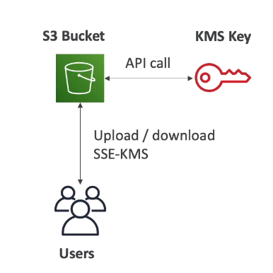
- if you use SSE-KMS you may be impacted by the KMS limits: khi bạn sử dungj server side encryption bạn có thể bị ảnh hưởng bởi giới hạn KMS
- When you load, S3 calls the "GenerateDataKey" of KMS API
- When you download, S3 calls the "Decrypt" of KMS API
- Count towards the KMS quota per second (5500, 10000, 30000 request/s based on region) :
  Tính toán đối với KMS hạn nghạch/giây (5500, 10000, 30000 yêu cầu/s dựa trên region)
- You can request a quota increase using the Service Quotas Console: banjc cos

_9.3 S3 Baseline Performance: Optimized_
- Multi-part upload: 
 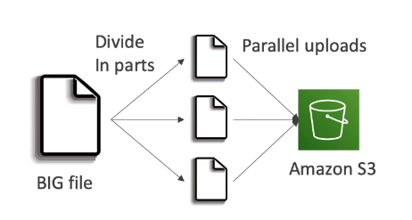
  - recommended for file > 100MB, Must use for file > 5GB
  - Multi-part upload, can help parallelize uploads (speed up transfers): Multi-part upload có thể hỗ trợ tải lên song song (tăng tốc độ truyển giao)
- S3 Transfer Acceleration - use for upload and download: tăng tốc chuyển giao s3
  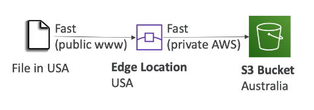
  - Increase transfer speed by transferring file to an "AWS edge location" which will forward the data file to the s3 bucket in the target region:
  Tăng tốc bằng cách truyfeenf file qua 1 "AWS edge location", cái mà sẽ truyển tiếp file sang s3 bucket trong region mục tiêu.
  - Now, AWS edge location have ~ 200, and it are growing
  - Transfer Acceleration compatible with multi-part upload : Transfer Acceleration tương thích với multi-part upload
  - file upload send public (www) to AWS Edge Location, AWS Edge Location send private to S3 Bucket Region

_9.3 S3 Byte-Range Fetches: for Reading file Efficient - đọc file hiệu quả_
- parallelize GETs by requesting specific byte range: song song GETs băngf cách yêu cầu cụ thể khoảng byte
- Better resilience in case of failures. Because you can retry a smaller byte-range: khả năng phục hồi tốt nhất trong tường hợp lỗi, vì bạn có thể thử chia nhỏ khoảng byte
- Can be used to speed up download
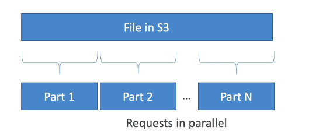
- Can be used to retrieve only partial data (for example the head of a file): có thể sử dụng để phục hồi 1 phần của data
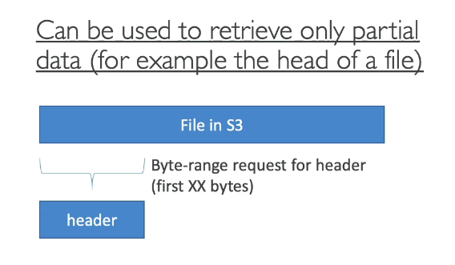

**10. S3 Select & Glacier Select**
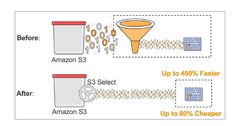
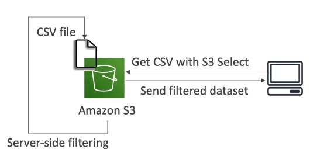
- Retrieve less data using SQL by performing server side filtering: Khôi phục lại phần nhỏ dữ liệu bằng cách thực hiện SQL server side filtering
- Can filter by rows & columns (simple SQL statements)
- Use Less network transfer,Use less CPU cost client-side: sử dụng mạng truyển giao ít hơn, cà chi phí CPI dưới phía người dùng ít hơn
- S3 will perform select, filtering for you and only return data you need

**10. S3 Event Notifications**
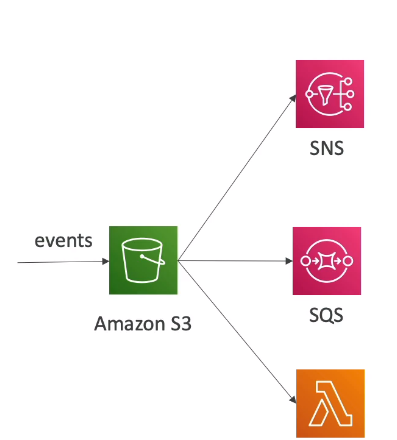
- S3:ObjectCreated, S3:ObjectRemoved, S3:ObjectRestore
- You can filter these events. You can filter extension files ... 
- Object name filtering possible (*.jpg): tên object loc có thể xử lý đươc
- Use case: generate thumbnails of images uploaded to s3
- Cam create as many (s3 events) as desired
- S3 event notifications typically deliver events in seconds but can sometimes take a minute or longer
  S3 event notifications thường cung cấp các sự kiện trong giây nhưng có thể thình thoảng mất 1 phút hoặc nhiều hơn

**S3 Event Notifications with Amazon EventBridge**
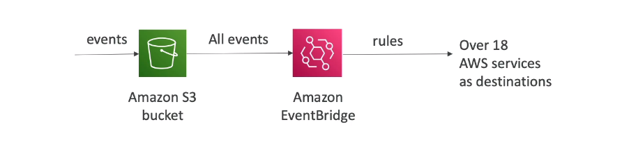
- Advanced filtering option with Json rule (meta data, size, name)
- Multiple Destination -  18 service of AWS
- EventBridge Capabilities - Archive, Replay event, reliable delivery

**11. S3 Request Pays** 

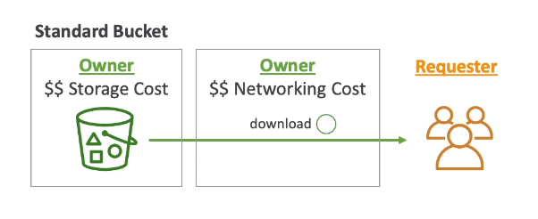
- in general, bucket owner will pay for all Amazon S3 storage and data transfer costs associated with their bucket

- Requester Pays buckets:
 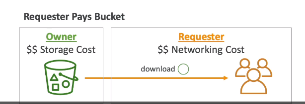
  - the requester instead of the bucket owner pays the cost of the request and the data download from bucket. Owner still pay for S3 storage bucket
  Nguời yêu cầu thanh toán buckets, người yêu cầu thay thế chủ sở hữu của bucket thanh toán chi phí của yêu cầu và dữ liệu download của bucket
  - Helpful when you want to share large datasets with other account
  - The request must be authenticated in AWS (cannot be anonymous): thanh toán này phải được xác thưc trong AWs (không được ẩn danh)

**12. Glacier vault lock: Khóa kho đóng băng**
- Adopt a Write Once Read Many model
- you put objects into your S3 Glacier Vault and then you lock it so it cannot be ever changed and deleted => Create a Vault Lock Policy
 bạn đẩy object vào trong S3 Glacier Vault của bạn và sau đó nó bị khóa vì thể nó không bao giờ thay đổi được và xóa đươc => tạo chính sách  Vault Lock
- Lock the policy for future edits (can no longer be changed and deleted - khoong thể thay đổi hoặc xo)
- Helpful for compliance and data retention: hữu ichs  cho tuân thủ và lưu trữ dữ liệu

_12.1 Object lock (verisoning must be enabled)_
- adapt Write Once Read Many model
- block an object version deletion for special amount of time: chnặ 1 object xóa bỏ object version trong 1 khoảng thời gian nhất định
- Retention mode - Compliance: Chế độ lưu giữ - tuân thủ
  - object versions can't be overwritten or deleted by any you, including the root user 
  - Object retention modes can't be changed, and retention periods can't bet shorted: 
  Object trong chế độ lưu trữ không thể thay đổi và thời gian lưu trữ không thể được rút ngắn

- Retention mode - Governance: Chế độ lưu giữ - Quản trị
  - most user can't overwrite or delete an object version or alter its lock setting
  - Some users have special permissions (through IAM) to change the retention or delete the object

- Retention Period: chế độ lưu giữ - khoảng thời gian (use Compliance & Governance)
  - Protect the object a fixed period, it can be extended

- Legal Hold: nắm giữ hợp pháp
  - Protect the object indefinitely, independent from Retention Period:
  Bảo vệ object vô thời hạn, không phụ thuộc vào "Retention Period"
  - Someone who has the IAM permissions S3:PutObjectLegalHold => has permission take any objects, put legal hold or remove legal hold

**13. S3 Object Lambda** 

_13.1 Access Point_
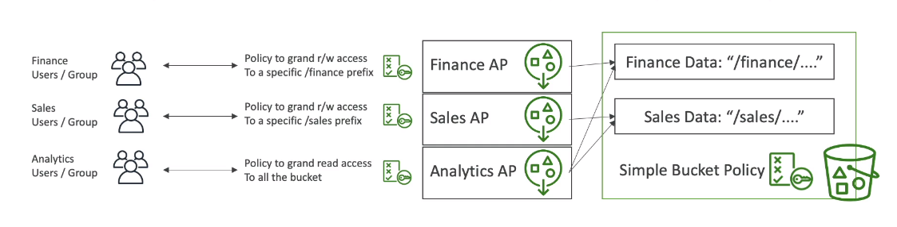
- If you have more User and more User group, the bucket policy can become complicated => S3 Access Point: Nếu bạn có nhiều user hơn và nhiều group user hơn, thì bucket policy ngày càng phức tạp => Access Point 
- Each access point gets its own DNS and own Policy to limit who can access it:
 Mỗi Access point nhận DNS riêng và Policy riêng để giới hạn ai có thể truy cập nó
  - Specific IAM user/ group
  - One policy / Access Point => Easier to manage the complex bucket policy

_13.1 S3 Object Lambda_
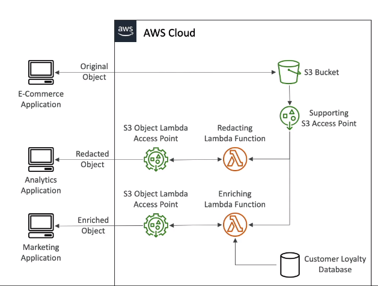
- Use AWS Lambda Function to change before the object it is retrieved by the caller application
 Sử dụng AWS Lambda Function để thay đổi object trước khi object được hồi phục vởi caller application
- Only one S3 bucket is needed, on top of which we create S3 Access Point and S3 Lambda Access Point:
 Chỉ 1 s3 bucket được cần, trên đó cái mà chúng ta tạo 1 S3 Access Ponint và S3 Lambda Access Points

- Use case: 
  - Redacting personally identifiable information for analytics or non-production environment: Biên soạn thông tin nhận dạng cá nhân hóa cho nghiên cứu hoặc không phải môi trường production
  - Converting across data formats, such as converting XML to JSon
  - Resizing an watermarking images on the fly using caller-specific details, such as the user who requested the object: thay Đổi kích cỡ và hình ảnh mờ trên chuyến bay sử dụng chi tiết chỉ định cuộc goijm như là ai đã request object

**14. S3 Batch Operations**
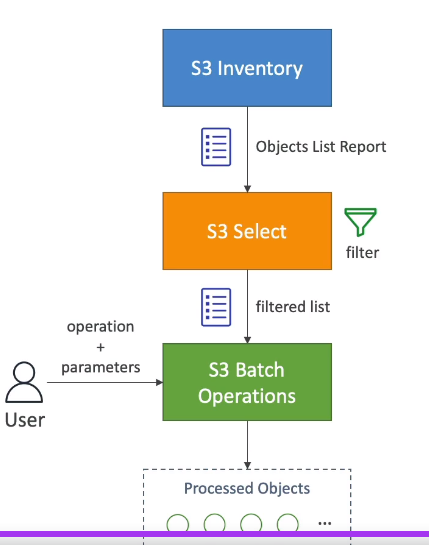
- Perform bulk operations on existing S3 object with single request: Thực hiện số lượng lớn hoạt động trên S3 objects đang tồn tai, trong 1 yêu cầ
  - Modify object metadata & properties
  - copy objects between s3 buckets
  - encrypt all un-encrypted objects in S3 bucket
  - Restore objects from S3 Glacier
  - call Lambda function to perform custom action on each object
- a Job consist of a list of objects, the action to perform, and optional parameters:
 Mỗi job bao gồm 1 danh sách object, các hoạt động để thực hiện và tham số tùy chọn
- S3 Batch Operations manages retries, tracks progress, sends completion notification, generate reports...
  S3 Hoạt động hàng hoạt quản lý phục hồi, theo dõi xử lý, hoàn thành gửi thông báo, tạo báo cáo ...
- You can use S3 inventory to get object list and use s3 select to filler your objects:
  bạn có thể sử dụng "inventory" (kiêmr kê tài sản) để nhận danh sách object và lựa chọn để lọc objects của bạn