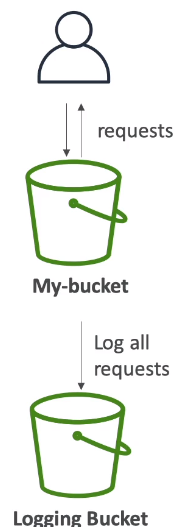
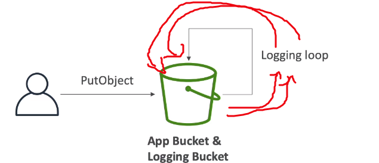

**1. MFA - DELETE**
-MFA (multi-factor authentication) forces user to generate a code on a device (usually a mobile phone or hardware) before doing important operations on S3
 xác thực đa nhân tố bắt buộc người dùng để tạo ra mã trên 1 thiết bị (thông thương là điện thoại hoặc phần cứng) trước thực hiện các hoạt động quan trọng trong s3
- To use MFA-Delete, enable Versioning on the S3 bucket: để sử dụng MFA-Delete, cho phép đánh phiên bản trên s3 bucket
- You will need MFA to 
  - permanently delete an object version: xóa vĩnh viễn 1 phiên bản object
  - suspend versioning on the bucket: đình chỉ đánh phiên bản trên s3 bucket
- You won't need MFA for:
  - enable versioning
  - list deleted versions
- Only the bucket owner (root account) can enable/disable MFA-Delete: chỉ chủ sở hữu bucket(root account) có thể cho phép/vô hiệu hóa MFA-DELETE
- MFA Delete currently can only be enabled by using the CLI: xóa sử dụng MFA hiện tại chỉ có thể kích hoạt bằng cách sử dụng CLI

**2. Default Encryption vs Bucket Polices**
- One way to "force encryption" is to use a bucket policy and refuse any API call to PUT an S3 object without encryption headers
  Một cách để bắt buộc mã hóa là sử dụng pucket policy và từ chối bắt kỳ  API gọi đến PUT 1 S3 object không có encryption headers
- Another way is to use the "default encryption" option in s3
 Cách khác là sử dụng mặc lựa chọn định mã hóa trong s3
- Note: Bucket policies are process evaluated before "default encryption"
  Bucket policies thực hiện phỏng đoán trước 'defautl encryption' 

**3. Access logs**

- For audit purpose, you may want to log all access to s3 buckets
- any request made to s3m from any account, authorized or denied, will be logged into another s3 bucket: bất kể yêu cầu được tạo ra đến S3, từ bất kể tài khoản nào, được ủy quyền hoặc bị từ chối, đều được ghi vào trong S3 bucket khác

_3.1 Access logs: Warning_

- Do not set your logging bucket to be the monitored bucket:Không đặt logs bucket vào nhóm bucket được theo dõi
- It will create a logging loop, and your bucket will grow in the size exponentially: Nó sẽ tạo ra những vòng log, và kích thước bucket của bạn sẽ tăng lên theo cấp số nhân