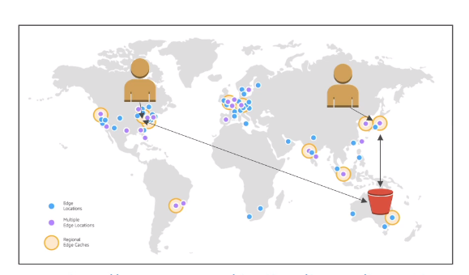
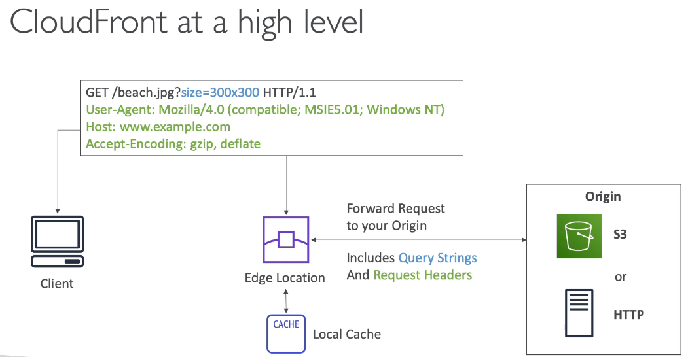
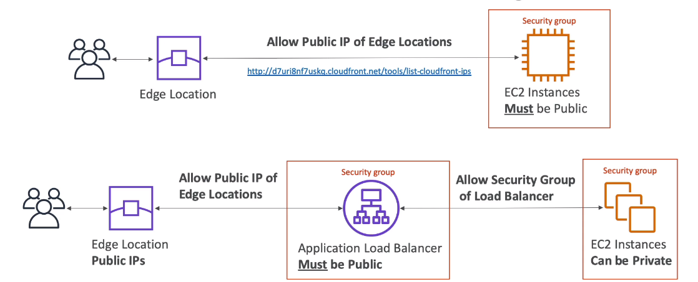
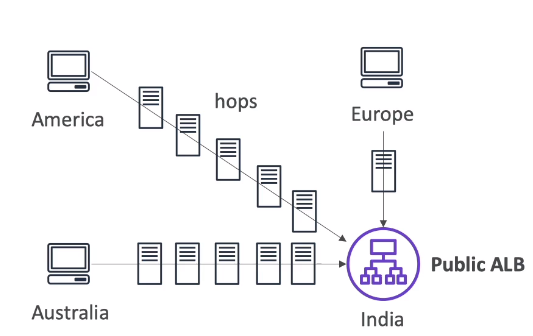
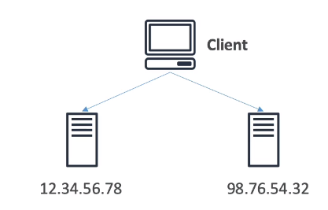
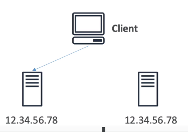
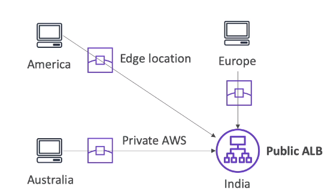

**1. CloudFront Overview**

_1.1 AWS CloudFront_

- CloudFront is Content Delivery Network (CDN) : Mạng vận chuyển nội dung
- Improves read performance,because content is going to be distributed and cached at the Edge Location: Nó cải thiện hiệu xuất đọc vì nội dung được phân tán và lưu trữ cache trên Edge Location
- Edge Location has 216 Point of Presence globally
- DDoS protection, integration with Shield, AWS Web Application Firewall: bảo vệ khỏi tấn công DDoS, tích lợp với lá chắn, AWS Application firewall
- Can expose external HTTPS and can talk to internal HTTPS to application: có thể phơi bày HTTPS ra bên ngoài và có thể trò truyện với HTTPS ứng dụng nội bộ

_1.2 AWS CloudFront - Origin_

_1.2.1 S3 bucket_
- For distributing files and caching them at the Edge Location 
- Enhanced security with CloudFront Origin Access Identity (OAI): nâng cao bảo mật với CloudFront Origin Access Identity (OAI)
- CloudFront can be used as an ingress (to upload file to S3)
- CloudFront will be sent private traffic to S3 bucket

_1.2.1 Custom Origin (HTTP)_
- Application LoadBalancer
- EC2 instance
- S3 website (must first enable the bucket as a static s3 website)
- any Http backend  you want

_1.3 CloudFront at a High Level_

_1.4 CloudFront - S3 as an Origin_

_1.5 CloudFront - ALB or EC2 as a origin_

_1.6 CloudFront - Geo Restriction: Hạn chế địa lý_
- You can restrict who can access your distribution (CloudFront)
  - Whitelist: Allow your users to access your content only if they are in one of the countries on a list approved countries
  - BlackList: Prevent your users from accessing your content if they are in on of the countries on a blacklist banned countries: 
  Ngăn chặn người dùng có thể truy cập nội dung của bạn nếu họ là 1 trong những nước trong danh sách đen các nước bị chặn
- the "country" is determined using 3rd party GEO-IP database: quốc gia được xác định sử dụng cơ sở dữ liệu GEO-IP của bên thứ 3 
- Use case: Copyright Laws to control access to content

_1.7 CloudFront - Cross Region Replication_
- CloudFront:
  - Global Edge Network: mạng lưới toàn cầu
  - file are cached for TTL-Time To Live (maybe a day) 
  - Great for static content that must be available everywhere

- S3 Cross Region Application
  - must be setup for each region you want replication to happen
  - file are updated in near real-time
  - Read only
  - Great for dynamic content that needs to be available at low-latency in few regions

**2. CloudFront - Price Classes**
_2.1 CloudFront - Prising_

- Cloud Front Edge Locations are all around the word
- The cost of data out per Edge Location varies: Chi phí của dữ liệu trên mỗi Edge Location sẽ thay đổi 

_2.2 CloudFront - Price Classes_

- You can reduce the number of Edge Locations for  cost reduction

- Three Price Classes
  1. Price Class ALL: all regions - best performance
  2. Price Class 200: most region, but excludes the most expensive regions - hầu hết các regions, nhưng loại trừ hầu hết các region có chi phí đắt đỏ
  3. Price Class 100: only the least excludes regions - Chỉ các khu vự có chi phí ít tốn kém nhất

**3. CloudFront - Cache Invalidation: Vô hiệu hóa bộ nhớ đệm**

- In case you update the backend origin, CloudFront doesn't know about it and will only get the refreshed content after the TTL has expired:
 Trong trường hợp bạn cập nhâp backend của Origin. CloudFront không biết về điều đó à nó sẽ chỉ nhận được nội dung làm mới sau khi TTL hết hạn
- However, you can force an entire or partial cache refresh by performing a "CloudFront Invalidation"
  Tuy nhiên, bạn có thể bắt buộc toàn bộ hoặc một phần bộ bộ nhớ đệm  làm mới bằng thực hiện "CloudFront Invalidation"
- You can invalidation all files (*) or a special path (/images/*)

**4. AWS Global Accelerator - Overview : AWS máy gia tốc toàn cầu**

_4.1 Global users for our application_

- You have deployed an application and have global users who want to access it directly.
- They go over the public internet, which add a lot of latency due to many hops  through the routers:
 Họ truy cập internet công công, cái mà thêm nhiều độ trễ,do có nhiều bước nhẩy qua các bộ định tuyến
- We wish to go as fast as possible through AWS network to minimize latency: 
  bạn mong muốn là đi nhanh nhất có thể qua AWS network để có độ trễ thâp

_4.2 Unicast IP vs Anycast IP_
- Unicast IP: one server holds one IP address
  

- Anycast IP: all servers hold the same IP address and the client is routed to te nearest one

_4.1 AWS Global Accelerator_

- Leverage the AWS internal network to route to your application
- Client instead of sending traffic through the public in Country,  it going to come to the closest Edge Location.
 From Edge Location, it is going to go all the way traight to ALB through internal AWS network:
 Cliet thay vì gửi lưu lượng truy cập thông qua mạng internet công khai, nó sẽ đi đến Edge Location gần nhất
 Từ Edge Location nó sẽ gửi thẳng đến Application Load balancer của bạn thông qua mạng mạng nội bộ của AWS
- 2 Anycast IP are created for your application
- The Anycast IP send traffic directly to Edge Locations
- The Edge Locations send the traffics to your application through internal AWS network
- Works with Elastic IP, EC2 instance, ALB, NLB, public or private
- Consistent Performance: Hiệu xuất nhất quán
  - Intelligent routing to lowest latency and fast regional failover: Định tuyến thông minh để có độ trễ thấp và chuyển đổi dự phòng khu vực nhanh chóng
  - No issue with client cache (because th IP don't change)
  - internal AWS network
- Health Checks:
  - Global Accelerator performs a heath check of your applications
  - Help make your application global (failover less than 1 minute for unhealthy)
  - Great for disaster recovery

- Security:
  - only 2 external IP need to be whitelisted
  - DDoS protection (use AWS Shield)

**_5. AWS Global Accelerator vs CloudFront_**
**SAME**
- the bold use the AWS global network and its edge locations around the world
- Both services integrate with AWS shield for DDoS protection

**Different**
- CloudFront:
  - improves performance for both cacheable content (such as images and video): cải thiện hiệu xuất với lưu trữ nội dung trong bộ nhớ cache
  - Dynamic content (such as API acceleration and dynamic site delivery): Nội dung động (như là tăng tốc APIvà   phân phối site động)
  - content is served at the Edge Location

- AWS Global Accelerator:
  - Improves performance for a wide range of application over TCP or UPD: Cải thiện hiệu xuất cho vùng rộng lớn của ứng dụng sử dingj UDP và TCP
  - Proxying packets at the Edge to application runing one or more AWS regions: Ủy quyền cho Edge Location đến ứng dụng cahayj trong 1 hoặc nhiều AWS region
  - Good fit for non-HTTP using case, such as gaming (UDP), IoT (MQTT), or Voice over IP
  - Good for HTTP use cases that required static IP address
  - Good for HTTP use cases that required deterministic fast regional failover
