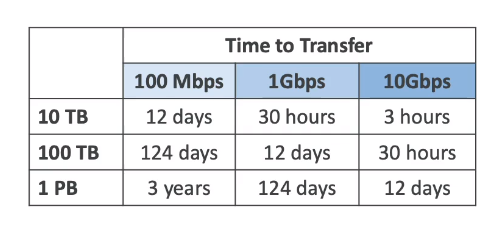
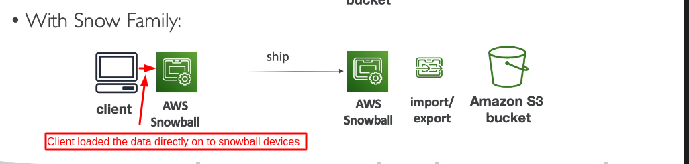
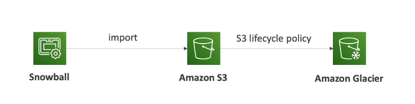

**1. AWS Snow Family**

- Highly-secure, portable devices to collect and process data at the Edge and migrate data in and out of AWS:
  An toàn cao, thiết bị cầm tay để thu thập và xử lý dữ liệu trên Edge và chuyển dữa liệu bên trong và ngoài AWS
- Data migration has three kind:
    - Snow cone
    - Snowball Edge
    - SnowMobile

- Edge Computing
    - Snow cone
    - Snowball Edge

_1.1 Data Migrations with AWS Snow Family_

- Challenges: thách thức
    - Limited connectivity
    - Limited bandwidth
    - High Network cost
    - Share bandwidth (can't maximize the line)
    - Connection stability: Ổn định kết nôis
- AWS Snow Family are: offline devices to perform data migrations, If it takes more than a week to transfer over the
  network => use Snowball devices AWS Snow Family là thiết bị ngoại tuyến để thực hiện chuyển giao giữ liệu, nếu nó mất
  nhiều tuần để truyển giao trên mạng => sử dụng Snowball devices
- AWS will send you an actual physical device by Post office, and then you load your data onto it, and then send it back
  to AWS
- Diagrams
    - Direct upload to S3
      
    - With Snow Family
      

_1.2 Snowball Edge (for data transfer: chuyển giao dữ liệu)_

- Physical data transport solution: move TBs (Terabytes) or PBs(Petabytes) in or out of AWS
- Alternative to moving data over network (and paying network fees): thay thế cho di chuyển dữ liệu qua mạng (và thanh
  toán phí mạng)
- Pay per data transfer job
- provide block storage and Amazon S3-compatible a block storage: cung cấp khối lưu trữ và đối tượng lưu trữ tương thích
  Amazon s3
- **Snowball Edge Storage Optimized**: 80 TB of HDD capacity for block volume and s3 compatible object storage
- **Snowball Edge Compute Optimized**: 42 TB of HDD capacity for block volume and S3 compatible object storage
- Use Case: large data cloud migration, Data Center (DC) decommission, disaster recovery

**_1.3 AWS Snowcone_**

- Small, portable computing devices, anywhere, rugged & secure, withstands harsh environments: Nhỏ, thiết bị tính toán
  cầm tay, ở mọi nơi, xù xì, chịu được môi trường khắc nghiệt
- Light (4,5 pounds = 2.1kgs)
- Devices used for edge computing, storage, and data transfer
- 8 TBs of usable storage
- Use Snowcone where Snowball does not fit (space-constrained environment): sử dụng Snowcone khi Snowball không vừa (
  không gian môi trường hạn chế)
- Must provide your own battery / cables
- Can be sent back to AWS offline, or connect it to internet and use AWS Data Sync to send data: Có thể được gửi lại
  AWS, hoặc kết nối nó đến internet và sử dụng AWS DataSync để gửi dữ liệu

**2. Solution Architecture: Snowball in to Glacier**

- snow ball cannot import to Glacier directly
- you must use Amazon S3 first, in combination with an S3 lifecycle policy

**3. Amazon FSx - Overview**

- Launch 3rd party high-performance file system on AWS:  để khởi chạy hệ thống file hệu suất cao của bên thứ 3 trên AWS
- Fully managed Service
    - FSx for Lustre
    - FSx for Windows file Server
    - FSx for NetApp ONTAP
    - FSx for OpenZFS

**_3.1. Amazon FSx for Window file Server_**
- FXs for Windows is a fully managed Window File System share drive: FXs for Windows là đổ đĩa chia sẻ quản lý tất cả Window File Systems
- Support SMB protocol & Windows NTFS 
- Microsoft Active Directory integration, ACLs (Access Control List), user quotas
- Can be mounted to Linux EC2 instances
- Support Microsoft Distributed File System (DFS) Namespaces (group file across multiple File System)
- Scale up to 10s of GB/s, millions of IOPS, 100s PB of data
- Storage Options:
  - SSD: latency sensitive workloads (databases, media processing, data analytics ...)
  - HDD:  broad spectrum of workloads(home directory, CMS ...): khối lượng công việc rộng lớn