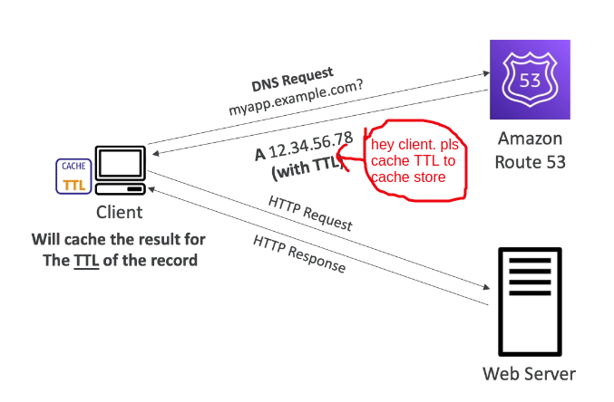
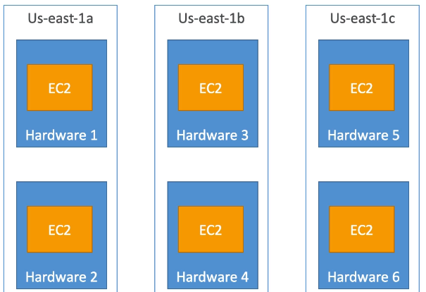
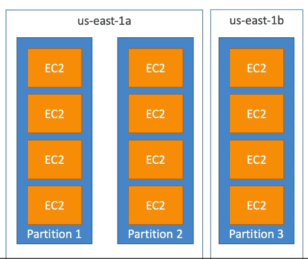

1. Private vs Public & Elastic IP

1.1Private vs Public IP (IPv4)
- IPv4 basically, it is four numbers separated by three dot:
    Về cơ bản IPv4 là 4 chữ số cách nhau bởi 3 dấu "."
- IPv6 less common, basically it's strange string of exotic symbol numbers:
 IPv6 its phổ biến hơn, và nó là một đoạn chuỗi lạ lùng, ký tự, số
- IPv4 right now is still the most common format used online: IPv4 còn là định dạng phổ biến nhất được sử dụng
- IPv6 is newer and solves problem for Internet of Thing (IoT)
- Ipv4 allow for 3.7 billions different address in the public space: IPv4 cấp phép cho ,37 tỷ địa chỉ khác nhau trên không gian công cộng
- IPv4: [0-255].[0-255].[0-255].[0-255]
- Public IP: 
  + Public IP means the machine can be identified on the internet:
    Public ip nghĩa mà máy của bạn được xác định trên internet
  + Public ip must be unique across whole internet (no two machines can have the same public IP)
    Public ip phải là duy nhất trong toàn bộ internet, không có máy thứ 2 có Public ip tương tụw
- Private IP:
  + Private IP means the machine can only be identified on a private network only:
    Private IP  nghĩa là máy chỉ được xác định trong mạng nội bộ
  + Private IP must be unique across whole private network: Private IP chỉ duy nhất trong toàn bộ mạng nội bộ 
  + Two private network (of 2 company) can have the same private IP
  + Machines connect to internet  using NAT + internet gateway (a proxy)
  + Only specified range of ÍPs can you private IP

1.2 Elastic IPs:

When you start or stop a EC2 instance, it can change it public ip
- if you need fixed public IP for you instance. you need an Elastic IP: muốn cố định ip của EC2, bạn cần 1 Elastic IPs 
- An Elastic IP is public ipv4 you own as long as you don't delete it:
  một Elastic IPs là 1 ip công cộng v4, bạn sở hữu nó
- YOu can attach it to one instance at a time: bạn có thể gắn nó với 1 instance trong 1 thời gian
- With Elastic IP address, When this EC2 have error, you can mask the failure of instance or software, by rapidly remapping the address to another instance in your account:
  Vơis Elastic IP, khi EC2 này có lỗi, bạn có thể che giấu lỗi của instance bằng cách ánh xạ lại "địa chỉ Elastic IP" cho EC2 instance khác thuộc sở hữu của bạn
- You can have 5 Elastic IP in your account (you can ask AWS to increase that)
- Overall. try to avoid using Elastic IP: Nhinf chung cố gắng tránh sử dụng 
  - They often reflect poor architectural decision: Nó có kiến trúc nghèo nàn
  - instead, using random public IP and register a DNS name to it: thay vào đó sử dụng public ip ngẫu nhiên và DNS name
  - Or, we can use Load Balancer mapping to private IP of it. Hoặc sử dụng cân bằng tải và ánh xạ nó đến địa chỉ nội bộ

1.3 In AWS EC2 - Hand on
- by default, your EC2 machine come with:
  - a private IP for internal AWS network: sử dụng ip riêng trong mạng nội bộ
  - public ip for www: sử dụng ip công cộng cho www
- When we are doing SSH into our EC2 machines: Trong trường hợp SSH, sẽ không thể dùng được private ip, chỉ dùng được khi connet VPN vào mạng đó
  - we can't using private ip, because we not in the network
  - SSH can using private ip of instance, only case you use VPN

2. Private vs Public & Elastic IP HAND ON
- Create new Choose Elastic IP: EC2 console > Elastic IP > Create new
- Attach Elastic IP for EC2 instance: choose Elastic IP đã tạo > click "Action" > "Associate" for instance

3. Placement Groups: Nhóm vị trí
- Sometimes you want control over the EC2 instance placement strategy.
Đôi khi chúng tao muốn điều kiển tất cả EC2 instance vị trí chiến lược.
- That strategy can be defined using "Placement group" : Chiến lược đó là có thể xác định bằng cách sử dụng "Placement group"
- When you create a placement group, you specify of the one of the following strategies for the group:
  - Cluster: Cụm
  - Spread: dàn trải
  - Partition: phân vùng

3.1 Cluster: cụm

 - instance will be groups together into a low-latency hardware setup in a single Availability Zone(AZ)
  Cụm Cluster nghĩa là các instance sẽ group lại với nhau vào trong 1 thiết lập vật lý có độ chễ thấp trong duy nhất 1 AZ
 - Ưu điểm: Great for network (10GB bandwith between instance): tốt cho mạng vì tất cả instance đều chung trên 1 khay của AWS
 - Nhược điểm: If the crack fails, all instances fail at the same time: Khi 1 giá máy chủ của AWS fail => all instance fail. trong cùng 1 thời gian
 - Use Case:
   - Big data job that needs to complete fast: ứng dụng xử lý lượng lớn data và cần hoàn thành nhanh
   - Application that nêed extremely low-latency and High network throughput: Ứng dụng cần độ chễ vô cùng thấp và thông luowgj cao
   - 
3.2 Spread: dàn trải
   
- Spread instance across different hardware (Max  7 EC2 instances/ group/ AZ)
 Dàn trả các instance qua các phần cứng khác nhau
- Ưu điểm :
  - Can span across multiple AZ: có thể trải instance ra nhiều AZ
  - reduced risk of all instance simultaneous fail: giảm nguy cơ tất cả các instance điều có thể fail
  - EC2 instance are on different physical hardware: đảm bảo EC2 instance ở trên nhiều phần cứng khác nhau  
- Nhược điểm: Max  7 EC2 instances/ group/ AZ
- Use case:
  - Application need maximize high availability and reduce risk: Ứng dụng cần sự khả dụng cao và giảm rủi ro
  - Critical application where your instance failures must be isolated from one another.
    Quan trongj khi ứng dụng của ta bị lỗi thì phải cô lập với các instance khác không để lỗi

3.3 Partition: phân vùng

- Spread instance across different "Partition" (Max  7 EC2 Partition/ AZ)
  Dàn trả các instance qua các phần cứng khác nhau
- Can span across multiple AZ in the same region
- Up to  7 Partition/ AZ
- Up to  100 EC2 instance
- The instance in partition do not share (contain) racks with the instances in the other partition:
  Instance và partition sẽ không chứa racks của partition khác
- A partition failure can affect many EC2 but won't affect other partition:
  1 phân vùng fail sẽ ảnh hưởng đến rất nhiều EC2 nhưng sẽ không ảnh hưởng đến Ec2 trong phân vùng khác
- EC2 instance get access to partition information as metadata:
  EC2 instance truy cập vào phân vùng như siêu dữ liệu
- Use Case: Big data application, HDFS, HBase, Kafka, Cassandra