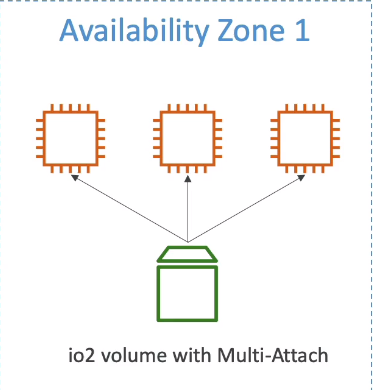
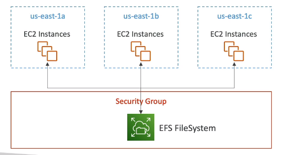
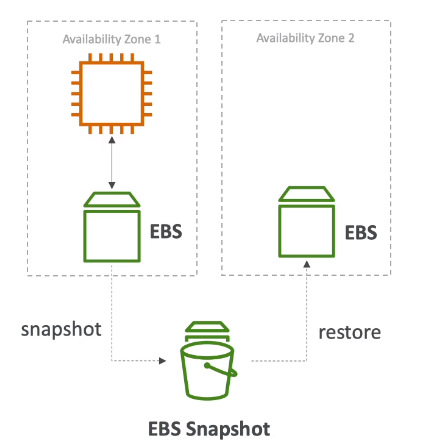
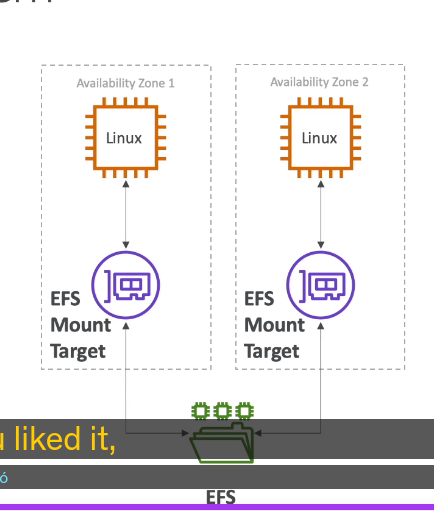

1. EBS
- EBS: (Elastic Block Store) Volume is a network drive you can attach to you instance while they run
  Elastic Block Store là một ổ đĩa mạng chúng ta có thể đính kèm với instance trong khi chúng chạy
- It allow your instances to persist data, even after their terminated: Nó cho phép dữ liệu của bạn tồn tại, thậm chí cả khi instance đã bị chấm dứt
- They can only be mounted to one instance at a time (at the CCP level): Chúng ta chỉ có thể gắn kết nó với 1 instance trong 1 thời điểm
- They are bound to specific Availability Zone: EBS chỉ khả dụng trên 1 AZ duy nhất
- Free tier: 30GB of free EBS storage of type General Purpose(SSD) or Magnetic/month
- It's a network drive (not a physic drive)
- It uses the network to communicate the instance, which mean there might be a bit of latency
  Nó sử dụng mạng để giao tiếp với instance, do đó có thể có chút độ trễ
- It can be detached from an EC2 instance, and attached to another one quickly:
  Nó có thể tách ra từ EC2 instance và đính vào EC2 instance rất nhanh
- It's Locked to an Availability Zone
  - eg. An EBS volume in ap-southeast-1, a cannot be attached to ap-southeast-2
  - To move a volume across from AZ to AZ, you first need snapshot it: Có thể di chuyển EBS AZ  to AZ, nhưng trước tiên cần snapshot của nó
- Have a provisioned capacity (size in GB, and IOPS)
  - You get billed for all the provisioned capacity: bạn có thể lấy bill cho tất cả drive
  - You can increase the capacity of the drive over time: bạn có thể tăng dung lượng cho drive theo thời gian
  
- EBS - Delete on termination attribute
- Controls EBS behaviour when EC2 instance terminates
  - By default, the root EBS volume is deleted
2. EBS Snapshots
- Make a backup(Snapshot) of your EBS volume at point of in time: tạo sao lưu của EBS tại mọi thời điểm
- Not necessary to detach volume to do snapshot, but recommended: Không cần thiết tách volumme ra snapshot, nhưng nó được khuyến nghị
- Can copy snapshot across AZ or region, The idea is that you would be able to transfer some of your data in a different region on AWS.
  Có thể copy snapshot trên các AZ hoặc Region, và ý tưởng là bạn có thể chuyển giao dữ liệu giữa các region hoặc AZ
- EBS snapshot features
  - EBS snapshot archive:
    - Move a Snapshot to an "Snapshot archive tier" that is 75% cheaper: Di chuyển snapshot đến "Snapshot archive" sẽ tối ưu 75% chi phí
    - Take within 24 to 72 hour for restoring from archive: Mất 24 đến 72h để phục hồi nố từ "archive"
  - Recycle Bin for EBS snapshot: mục đích là khi xóa snapshot sẽ không xóa ngay mà để nó vào thùng rác có thể phục hồi lại
    - Setup rule to retain deleted snapshot so you can recover them after accidental deletion: Thiết lập quy định là "giữ lại" bản đã xóa trong thùng rác để có thể phục hồi
    - specify retention (from 1 day to 1 year)

3. AMI overview
 - AMI =  Amazon Machine Image
 - AMI are a customization of an EC2 instance 
   - YOu add your own software, configuration, operating system, monitoring...
   - When using AMI => Faster boot/ configuration time because all your software is pre-packaged
   Sử dụng AMI -> sẽ cho thời gian khởi đông / cấu hình nhanh hơn  vì tất cả phần mềm của bạn đã được đóng gói trước
 - AMI are built for a specific region (and can be copied across regions): AMI được xây dựng trên 1 region, nhưng có thể copy đến tất cả các khu vực
 - You can launch EC2 instance from :
   - A public AMI: AWS provided
   - Your own AMI: you make and maintain them yourself
   - An AWS marketplace AMI: an AMI someone else made)
 
 - AMI PROCESS (From an EC2 instance)
   - step1: Start an EC2 instance and customized it
   - step2: stop instance (for dât integrity)
   - step3: build an AMI - This will also create EBS snapshot
   - Launch new instances from other AMI

4. EC2 instance store
- EBS volumes are network drive with good but "limited" performance
- if you need a high-performance hardware-disk, use EC2 instance store
- better input / output performance
- EC2 instance store lose their storage if they are stopped. (When you stop ỏ terminated EC2 instance store, then the storage will be lost)
    bạn sẽ mất EC2 instance store, nếu chung bị dừng lại (Khi dừng hoặc chấm dứt EC2 instance store, thì sau đó lưu trữ sẽ bị mất)
- Using for: good for buffer / cache / scratch data or temporary content
- But not using for: Long term storage (Tuyệt đối không sử dụng cho trường hợp lưu trữ lâu dài) 
- Risk of data loss if hardware fail: Rủ ro về mất dữ liệu nếu phần cứng có lỗi
- Backup and Replication are you responsibility: Sao lưu và tạo bản sao là nhiệm vụ của bạn, để tránh thất thoát

5. EBS volume types:
- EBS Volume come in 6 types:
    - gp2/gp3 (SSD): General purpose SSD volume that balances price and performance for a wide variety of workload:
    Ổ cứng SSD với mục đích chung, cân bằng giữa giá tiền và hiệu suất cho nhiều khối lượng công việc.
    - io1/io2 (SSD): Highest-performance SSD volume for mission-critical low-latency or high-throughput workloads
    Ổ cứng SSD có hiệu suất cao nhất cho nhiệm vụ quan trong, đệ trễ thấp hoặc khối lượng công việc cần thông lượng cao
    - st1 (HDD) low cost HDD volume designed for frequently accessed, throughput-intensive workload:
    ổ cứng HDD chi phí thấp, thiết kế cho khối lượng công việc thường xuyên được truy cập, là thông lượng chuyên sâu
    - sc1 (HDD) Lowest cost HDD volume designed for less frequently accessed workload
    ổ cứng HDD, chi phí thất nhất, thiết kế cho khối lượng công việc ít truy cập
- EBS Volumes are characterized in Size | Throughput | IOPS (operations/second)
- Boot volume is "the disk partition that contains the operating system folder" : phân vùng ổ đía chứa hệ điều hành
5.1 General purpose SSD
- cost effective storage, low latency: lưu trữ có chi phí hiệu quả, có độ trễ thấp
- Use for: system boot volumes, virtual desktop, development and test environment: sử dụng cho : khởi động hệ thống, máy ảo desktop, môi trường test và phát triển
- Size: 1Gb - 1Tb
- gp3: (newer generations of volumes: thế hệ mới hơn so với gp2)
  - Baseline  of 3.000 IOPS and throughput 125 MB/s
  - can increase IOPS up to 16.000 and throughput up to 1000 MB/s independently: Có thể tăng IOPS lên đến 16000 và throughput đến 1000MiB/s một cách độc lập "Nghĩa là 1 volume độc lập"
- gp2: 
  - small gp2 volume can burst IOPS to 3000
  - size of the volume and IOPS are linked, max IOPS is 16.000
  - 3 IOPS/1GB, means at 5.334 GB we are at the max IOPS

5.2 Provisioned IOPS (io1/io2)

- Using for:
  - critical business applications with sustained IOPS performance: Nghiệp vụ quan trong với việc duy trì hiệu suất IOPS
  - Or applications that need more than 16.000 IOPS (more gp3/gp2)
  - great of database workloads (sensitive to storage performance and consistency)
- io1/io2 (4Gib - 16 TiB):
  - Max PIOPS: 64.000 for Nitro EC2 instance & 32.000 for other
  - Can increase PIOPS independently from volume storage size: có thể tăng IOPS độc lập từ kích thước lưu trữ
  - io2 have more durability and more IOPS/GiB (at the same price as io1): có thể tăng độ bền và IOPS/GiB (với mắc giá tương đương io1)
- io2 Block Express (4 GiB - 64 TiB):
  - This gives you sub-millisencond latency: nó cho chúng ta độ chễ tính bằng mini giây
  - MAX PIOPS 256.000 with an 1000 PIOPS / 1Gib
- Support EBS Multiple attach

5.3 Hard Disk Drives (HDD) st1/sc1
- Cannot be boot volume
- Size: 125MiB to 16TiB
- Throughput Optimized HDD (st1)
  - Big data, Data Warehouses, Log Processing: dữ liệu lớn, kho dữ liệu, Xử lý nhật ký
  - max Throughput 500 MiB/s - max IOPS 500
- Cold HDD (sc1):
  - For data that is infrequently accessed: dữ liệu truy cập không thường xuyên 
  - scenarios where lowest cost possible: các tình huống cần chi phí thấp nhất có thể
  - max Throughput 250 MiB/s - max IOPS 250

6. EBS multi-attach - (ONLY io1-io2 Family)

- Attach the same EBS volume to multiple EC2 instance in the same AZ: đính kèm EBS volume vào EC2 instance trên cùng AZ
- Each instance has full read & write permission to the volume
- Use Case:
  - Archive higher application availability in clustered linux applications: Lưu trữ tính khả dụng của các úng dụng cao hơn trong các ứng dụng linux đã được phân nhóm (ex: Teradata)
  - Application must manage concurrent write operations: ứng dụng phải đồng thời hoạt động ghi
- Must use a file system that is cluster-aware: phải sử dụng file hệ thống nhận biết cụm

7. EBS encryption
- When you create an encrypted EBS volume, you get the following:
  - data at rest is encrypted inside the volume: dữ liệu nghỉ ngơi được mã hóa bên trong ổ cứng
  - all the data in flight moving between instance and the volume is encrypted: dữ liệu di chuyển giữa instance và volume đều được mã hóa
  - all snapshots are encrypted
  - all volume created from "snapshots encrypted" => encrypted
- Encryption has minimal impact to latency: Mã hóa ảnh hưởng rất nhỏ đến độ trễ
- EBS Encryption leverages keys from KMS (AES-256): Mã hóa EBS tận dụng khóa từ KMS (AES-256)
- Copying an unencrypted snapshot allow encryption: Khi Copy 1 snapshot không được mã hóa cho phép chúng ta mã hóa nó
- Snapshot of encrypted volume are encrypted => Snapshot của 1 ổ cứng đã được mã hóa luôn luôn mã hóa
- Encryption: encrypt an unencrypted EBS volume
  - step1: Create an ESB snapshot of the volume
  - step2: Encrypt the EBS snapshot (using copy)
  - step3: Create new EBS volume from snapshot(the volume will also be encrypted)
  - step4: now you can attach the encrypted volume to EC2 instance

8. Amazon EFS - Elastic File System

- Managed NFS (Network file system) that can be mounted on many EC2
- EFS work with EC2 instance in multi AZ
- highly available, scalable, expensive (3x price of pg2), pay/use: tính có sẵn cao, tính mở rộng cao, giá cao (đắt gấp khoảng 3 lần EBS gp2)
- Use case: content management, web serving, data sharing, wordpress
- Use NFSv4.1 protocol
- Use security group to control access to EFS
- Compatible with Linux based AMI (not Window): Chỉ tương thích với Linux (không tương thích với Window) 
- Encryption at rest using KMS (Mã hóa khi nghỉ sử dụng KMS)
- Using POSIX file system (Linux) that has standard file API: sử dung hệ thống POSI, nó có API tiêu chuẩn
- File system Scales automatically, pay/use, no capacity planning: File hệ thống của EFS mở rộng tự động, không cần lên kế hoặc về công suất trước 

8.1 EFS Performance
- EFS scale:
  - 1000s of concurrent NFS client, 10GB/s throughput
  - Grow to Petabyte-scale Network file system, automatically, not provision capacity plan: bạn có thể phát triển EFS file hệ thống mở rộng lên Petabye, Nó tự động, không cần plan công suất trước
- Performance mode (set at EFS creation time): Có thể đặt Chế độ hiệu suất khác nhau tại thời điểm tạo
  - General purpose (default): latency-sensitive use case (web server, CMS ...): sử dụng trường hợp độ trễ nhậy cảm
  - Max Input/Ooutput higher latency, higher throughput, higher parallel (big data, media processing): Nó cung cấp cho bạn Max Input/Output độ chễ cao hơn, thông lượng cao hơn, có tính song song cao
- Throughput Mode:
  - Bursting (1TB = 50MiB/s + burst of up to 100MiB/s) 1Terabyte nó thể bùng nổ 50MiB/s, cao nhất là 100MiB/s
  - Provisioned: set your throughput regardless of storage size: 1 GiB/s for 1 TB storage - Cung cấp: bạn có thể đặt thông lượng, bất kể kích thước lưu trữ của bạn

8.2 EFS - Storage Classes
- Storage Tier (lifecycle management feature - move file to different tier after N day)
  - Standard: for frequently accessed file: cho việc truy cập file thường xuyên
  - infrequently access (EFS-IA): cost to retrieve files. lower price to store, enable EFS-IA with lifecycle policy
    Truy cập không thường xuyên (EFS-IA): dùng cho lấy lại file, giá lưu trữ thấp, Cho phép EFS-IA với chính sách vongf đời
- Availability and durability:
  - Standard: multi-AZ, great for production
  - One Zone: One AZ, great for dev, backup enable by default, compatible with infrequently access IA (EFS OneZone - IA)
- Over 90% in cost saving

9, EBS vs EFS

9.1 Elastic Block Storage

- EBS volumes
  - Can be attached  to only one instance at time
  - are locked at the availability zone (AZ) level
  - gp2: Input/Output increase if the size increase
  - io1: can increase Input/Output independently from size volume
- To migrate an EBS volume across AZ (Chuyển EBS volume trên các AZ)
  - step1: take a snapshot
  - restore the snapshot to another AZ
  - EBS backup use IO and you shouldn't run them while your application is handling a lot of traffic: Sao lưu EBS sử dụng IO và bạn không nên chạy chúng trong khi ứng dụng của bạn đang sử lý nhiều truy cập
  - Root EBS volume of instances get terminated by default if the EC2 instance get terminates (you can disable that)

9.2 Elastic File system

- Mounting 100 of 1000 instance across AZ
- Use only Linux (Not Window)
- EFS share website file (WordPress)
- Only for Linux instances (POSIX)
- EFS has a higher price point the EBS: EFS có giá cao hơn EBS
- Can leverage EFS-IA(Elastic File system infrequently access) for cost saving : có thể tận dụng EFS-IA(Elastic File system infrequently access) để tiết kiệm chi phí

*********************
- EFS: for network file system: EFS - cho một hệ thống tệp
- EBS: for network volume: EBS - cho ổ cứng hệ thống
- Instance store: For Maximum amount of IOPS(Input Output Operations per seconds) onto EC2 instance. but somehting you lose data, use case is cachec ....
  (Instance store cho tối đa số lượng của IOPS trên EC2 instance, thi thoảng sẽ bị mất dữ liệu, sử dung cho trường hợp không lâu dài, ví dụ như Cache .,..)
*********************