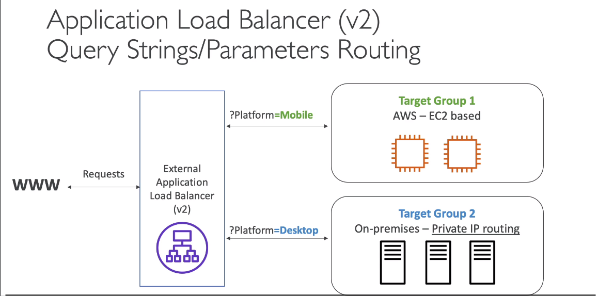
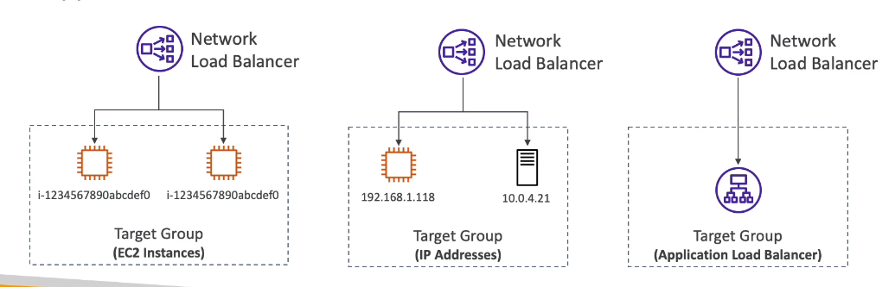
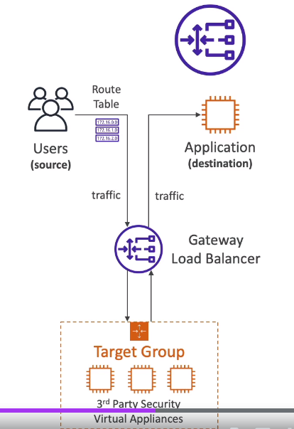
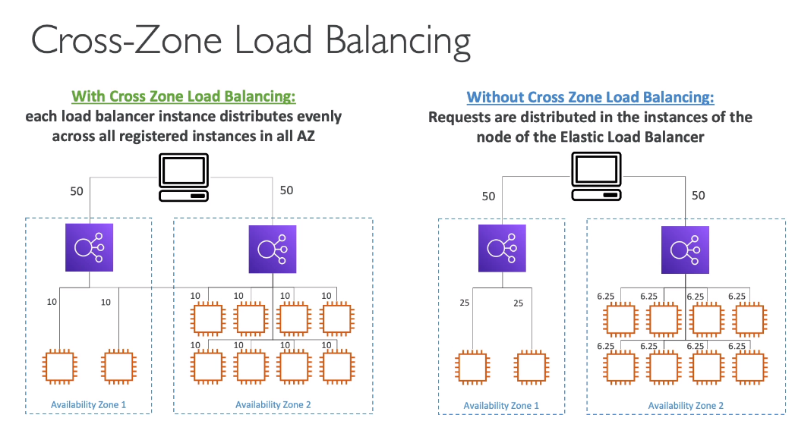
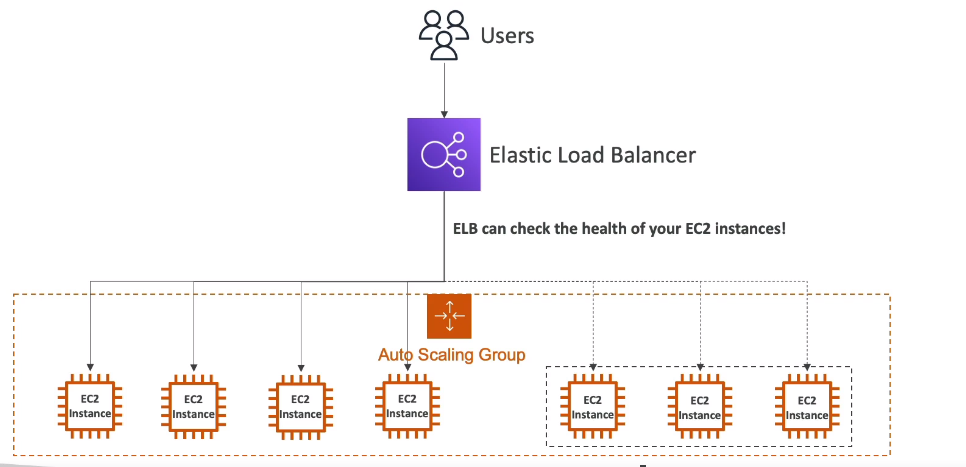
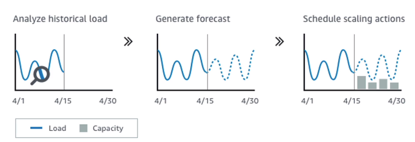
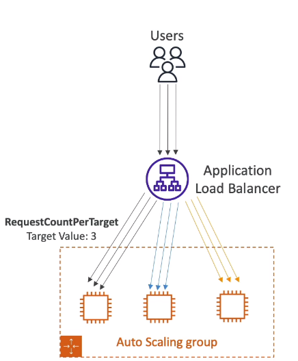
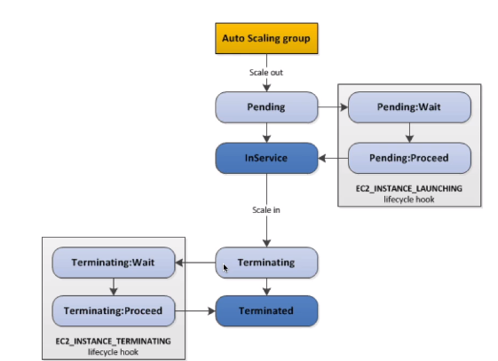

**1. Scalability and High Availability**

- Scalability means that an application/system can handle greater loads by adapting: khả năng mở rộng nghĩa là 1 ứng dung/ hệ thống có thể xử lý tải lớn hơn bằng cách thihs nghi
- There are two kinds of scalability:
  - vertical scalability: Theo chiều dọc
  - horizontal scalability (Elasticity scalability):  theo chiều ngang
- scalability is linked, but different to High Availability

_1.1 Vertical scalability:_
- vertical scalability means increasing the size of  the instances
- For example, your application runs on a t2.micro => scaling that application vertically means run it on a t2.large
- vertical scalability is very common for non-distributed systems, such as a database: mở rộng theo chiều dọc là rất phổ biến cho hệ thống phi phân tán, như là database
- RDS, ElasticCache are services that can scale vertically
- there is usually a limit to how much you can vertically scale(hardware limit): điều này thương là giới hạn mở rộng theo chiều dọc là bao nhiêu(nó bị giới hạn phần cứng)

_1.2 Horizontal scalability_
- Horizontal scalability means increasing the mumber of instance/system for your application
- Horizontal scaling implies distribute systems. Horizontal scaling ngụ ý là hệ thống phân tán
- This is very common for web applications/modern application
- it is easy to horizontal scale thanks the cloud offering such as Amazon ec2: nó rất dễ dàng để  mở rộng ngang, cảm ơn cloud đang cung câps như là Amazon ec2 

_1.3 High Availability_

- High Availability usually goes hand in hand with Horizontal scaling
- High Availability means running your application/system is at least 2 data center(== Availability Zones)
  High Availability nghĩa là chạy ứng dụng/hệ thôngs của bạn trên ít nhất 2 trung tâm dữ liệu
- the goal of High Availability is to survive a data center loss: mục đích của High Availability là hệ thống vẫn sống khi trung trâm dữ liệu  bị lỗi
- The High Availability can be passive (for RDS multi AZ for example)
- The High Availability can be active (Horizontal scaling)

***** Summary ******
- Vertical Scalability: increasing instance size (scale up/down)
  - From t2.namno - 0.5G of RAM, 1 vCPU
  - To u-12tb 1.meta -  12.3 TB of RAM, 448 vCPUs
- Horizontal scalability: increasing number of instances (= scale out/in)
  - auto scaling group
  - load balancer
- High Availability: Run instance for the same application across multi AZ
  - Auto scaling group multi-AZ
  - Load Balancer multi-AZ 

**2. Elastic Load Balancing**

_2.1 What is a Load Balancing:_
- Load Balancer are servers that forward traffic to multiple servers (e.g EC2 instances) downstream
  Load Balancer là máy chủ mà nó sẽ chuyển tiếp lưu tượng đến nhiều máy chủ thuận dòng
_2.2 Why use a Load Balancing:_
- Spread load across multiple downstream instances
- Expose a single a point of access (DNS) to your application: Expose 1 điểm truy cập duy nhất cho ứng dụng của bạn
- seamlessly handle failure of downstream instances: xử lý liền mạch những thất bại của instances hạ nguồn
- Load Balancer do regular health checks to your instances
- Provide SSL termination (Https) for your website
- Enforce stickiness with cookies
- high availability across zones
- separate public traffic from private traffic: tách rời lưu lượng public từ lưu lượng private

_2.3 Why use a Elastic Load Balancer:_
- An Elastic Load Balancer is managed load balancer
  - AWS guarantees that it will be working: AWS đảm bảo rằng nó sẽ hoạt dộngd dù bất kỳ điều gì
  - AWS take care of upgrades, maintenance, high availability of Load Balancer: Aws chăm sóc, bảo trì, và đảm bảo tính khả dụng cao
  - AWS provides only a few configuration knobs o the behavior of the load balancer: AWS cung cấp chỉ 1 vài núm cài đặt của load balancer
- Elastic Load Balancer costs less to setup your own load balancer but it will be a lot more effort on you end: Elastic Load Balancer có chi phí rẻ hơn so với bạn tự cấu hình nhưng bạn sẽ phải bạn lỗ lực rất nhiều
- Elastic Load Balancer is integrated with many AWS offerings / services: nó tích hợp với nhiều AWS dịch vụ
  - EC2, EC2 auto scaling groups. Amazon ECS
  - Route 53, AWS WAF ...

_2.4. Health check_
- Health check are crucial for Load Balancers: Health check rất quan trọng cho Load Balancer
- They enable the load balancer to known if instance it forwards traffic to are available to reply to request: Nó cho phép load balancer biết instance có chuyển tiếp lưu lượng truy cập có ẵn để trả lời yêu cầu
- They health check is done by using a port and a route ( example: "/heath" is common)
- if the response it NOT 200 (NOT  OK), then the instance is unhealthy

_2.4. Type of load balancer on AWS_
- AWS has 4 kinds of managed Load Balancer
- Classic Load Balancer (v1 - old generation) - 2009 - CLB: Http, Https, TCP, SSL(secure TCP)
- Application Load Balancer (v2-  new generation) - 2016 - ALB: Http, Https, web socket
- Network Load Balancer (v2-new generation) - 2017 NLB: TCP, TLS (secure TCP), UPD
- Gateway Load Balancer - 2020 GWLB : Operates at layer 3(Network layer) IP protocol
- Overall, it is recommended to use the newer generation Load Balancer the provide more feature
- Some load balancer can be setup as internal (private) or external(public) ELS

_2.5 Load Balancer Security Groups:_
Application Security Group: allow traffic only from Load Balancer

**3. Classic Load Balancer (v1)**
- Support TCP (Layer 4), Http & Https(Layer 7)
- Health check are TCP or Http based: health check dựa trên TCP or Http
- Fixed hostname: xxx.region.elb.amazonaws.com

**4. Application Load Balancer (v2)**
- Application Load Balancer is Layer 7(Http)
- Load Balancer to multiple applications across machines (target groups)
- Load balancing to multiple application on the same machine (Ex: containers)
- Support for Http/2 and Websocket
- support redirects (from Http to Https for example)
- Support Route Routing to different target group:
  - Routing based on path in URL (example.com/users & example.com/ports)
  - Routing based on hostname in URL (one.example.com & other.example.com)
  - Routing based on Query string, Header (Example.com/users?id=123&oder=false)
- Application Load Balancer are a great fit for microservices & container-based application (example Docker & Amazon ECS)
- Has a Port mapping feature to redirect to dynamic port in ECS: Có tính năng ánh xạ cổng -> chuyển hướng đến "cổng động của ECS"
- So sánh với Classic Load Balancer thì mỗi ứng dụng phải cần cần 1 Classic Load Balancer, nhưng Application chỉ cần 1
- Good to know
  - Fixed hostname
  - the application servers don't see the IP of the client directly
    - the true IP of the client is inserted in header (X-Forwarded-For)
    - We can also get Port (X-Forwarded-Port) and proto ((X-Forwarded-Proto)
    - 
_4.1 Target Group_
- EC2 instance (can be managed by an Auto scaling group) - Http
- EC2 tasks (managed by ECS itself) - Http
- Lambda functions - Http request is translated in to a Json event
- Ip address - must be private IPs
- ALB can route to multiple target group
- Health check are at the target group level

_4.2 Query string, Parameters Routing_

**5. Network Load Balancer**

- Network Load Balancer (Layer 4) allow to:
  - Forward TCP & UDP traffic to your instance
  - handle millions of request per seconds: Xử lý hàng triệu request/giây
  - Less latency ~100ms (vs 400ms of Application Load Balancer)
- NLB has one static IP/Availability Zone, support assigning Elastic IP(helpful for whitelisting specific IP)
- NLB are used for extreme performance, TCP or UDP traffic (extreme: vô cùng)
- not included in the AWS free tier: (không bao gồm AWS tầng miễn phí)

- Target Group:
  
  - EC2 instance
  - IP address - must be private IPs
  - Application Load Balancer

**5. Gateway Load Balancer**

- Deploy, scale, and manage a fleet of 3 party network appliances in AWS: Triển khi, mở rộng nhóm của 3 thiết bị mạng bảo trong AWS
- Example: firewall, intrusion detection and prevention systems, deep packet inspection systems, payload manipulation ...
  (Tường lửa, phát hiện xâm nhập và hệ thống phòng ngừa, các hệ thống kiểm tra gói chuyên sâu, thao tác trọng tải)
- Operates at layer 3 (network layer) 0 IP packet
- combines the following functions:
  - Transparent Network Gateway - single entry/exit for all traffic: cổng mạng minh bạch một lần vào/ra cho tất cả lưu lượng truy cập
  - Load balancer: distribute traffic to your virtual appliances: phân bổ lưu lượng mạng đến các thiết bị ảo của bạn
- Use the "Generic Network Virtualization Encapsulation" protocol on port 6081

- Target group 
  - EC2 instances
  - Ip address

**6. Sticky session**
- Về cơ bản Sticky session là một thành phần quan trọng trong Load Balancer, ví dụ chúng có 5 EC2 instance, trong lần đăng nhập đầu tiên thì người dùng của chúng ta kết nối với instance 2 vào order hàng vào giỏ hàng tại instance 2, thì đảm bảo khi request lấy thông tin giỏ hàng thì sẽ là session lưu trên instance 2.
- It is possible to implement stickiness so that the same client is always redirected to the same instance behind a load balancer
  Cụ thể nó sẽ thực hiện kết dính 1 client luôn luôn chuyển đến 1 instance (đã chuyển đến trước đó) phía sau của load balancer
- This work for Classic Load Balancer & Application Load Balancers
- The "cookie" used for stickiness has an expiration date you control: "cookie" đã được sử dụng cho "kết dính" có thời gian hệt hạn do bạn quản lý
- use case:  make sure the user don't lose his session data: tạo ra sự chắc chắn người dùng sẽ không mất dữ liệu "Phiên" của họ
- enabling stickiness may bring imbalance to the load over the backend EC2 instance 2 (some instance very very sticky user): Cho phép "kết dính" có thể cung cấp mất cân bằng tải qua backend EC2 instance (1 instance kết dính với 1 user)

_6.1 Sticky session Kinds (2 Kind)_
- Application-based Cookies:
  - Custom cookie
    - Cookies generated by the your application
    - can include any custom attributes required by the application (expiration date...)
    - Cookie name must specified individually for each "Target group": cookie name phải được chỉ định riêng biệt cho mỗi "Target group"
    - Don't use name "AWSALB", "AWSALBAPP" or "AWSALBTG" (Because reserved for use by Elastic Load Balancer)
    - Duration date can be specified by application itself: Khoảng thời gian có thể tự chỉ định bởi chính application
  - Application cookie
    - Cookies generated by the load balancer
    - cookie name is AWSALBAPP
    - Duration date can be specified by application itself: Khoảng thời gian có thể tự chỉ định bởi chính application
- Duration-based cookies
  - Cookies generated by the load balancer
  - Cookies name is AWSALB for Application Load Balancer, AWSELB for Classic Load Balancer
  - Duration time generated by load balancer itself

**7. Elastic Load Balancer - Cross Zone Load Balancing (Cân bằng tải xuyên khu vực)**

- Application load balancer
  - Application on (Can't be disabled): Cross Zone Load Balancing Application luôn luôn bật (Không thể vô hiệu hóa nó)
  - No charges ($) for transfer data between AZ : không tốn phí cho chuyển giao dữ liệu giữa các AZ
- Network Load Balancer
  - Disable by default
  - You need pay charges ($) for transfer data between AZ if enabled (Bạn phải thanh toán phí cho chuyển giao dữ liệu giữa các AZ)
- Classic Load Balancer 
  - Disable by default
  - No charges for transfer data between AZ if enabled

**8.Elastic Load Balancer - SSL Certificate**
_8.1 SSL/TLS - Basic_
- SSL certificate allows traffic between your client and your load balancer to be encrypted in transit (in-flight encryption)
- SSL refers to Secure Sockets Layer, used to encrypt connections (refers - ám chỉ, đề cập đến)
- TLS refers to Transport Layer Security, which is a newer version of SSL
- Nowadays, TLS certificates are mainly used, but people still refer as SLL : ngày nay TLS certificate được sử dụng chủ yếu, nhưng người ta vẫn gọi là SSL
- Public SSL certificate are issued by Certificate Authorities (CA): Public SSL certificate được phải hành bởi nhà chức trách chứng chỉ
  - Comodo, GoDadyy ....
- SSL certificates have an expiration date (you set) and must be renewed

_8.2 Load Balancer - SSL Certificates_
- The load balancer use an X.509 certificate (SSL/TLS server certificate)
- You can manage using ACM (AWS certificate manager)
- you can create upload your own certificates alternatively
- Https listener
  - You must specify a default certificate
  - you can add an optional list or certificate to support multiple domain
  - client can use SNI (Server Name Indicate) to specify the hostname the reach: client có thể sử dụng SNI để chỉ định tên máy chủ có thể đạt được
  - Ability to specify a security policy to support oder version of SSL/TLS (legacy clients): có khả năng chỉ định chính sách bảo mật cụ thể để hỗ trợ phiên bản của của SSL/TLS

_8.3 SNI - Server Name Indicate_
- SNI solves the problem of loading multiple SSL certificate onto one web server (to server multiple website)
- It is a "newer" protocol, and requires the client to indicate the hostname of the target server in the initial SSL handshake:
  Có là giao thức mới, và nó yêu cầu client chỉ định cho biết hostname của máy chủ mục tiêu trong lần đầu bắt tay
- The server will then find the correct certificate, or return the default one: Server sau đó, sẽ phải tìm chính xác certificate hoặc trả về mặc định một

- Note:
  - Only work for ALB & NLB (newer generation), CloudFront
  - Do not work for Classic Load Balancer (older generation)

_8.4 Load Balancer - SSL Certificates_
- Classic Load Balancer (v1)
  - support only one SSL certificate
  - Must use multiple Classic Load Balancer for multiple hostname with multiple SSL certificate
- Application Load Balancer(v2)
  - Support multiple listener with multiple SSL certificate
  - Use Server Name Indication (SNI) to make it work

- Network Load Balancer(v2)
  - Support multiple listener with multiple SSL certificate
  - Use Server Name Indication (SNI) to make it work

**9. Connection draining**
- Feature name:
  - Connection draining - for Classic Load Balancer
  - De-registration delay - for Application Load Balancer & Network Load Balancer

- Connection draining is time to "in-flight request" while the instance is De-registration or unhealthy: Connection draining là thời gian hoàn thành "request đang thực hiện" trong khi instance bị hủy đăng ký hoặc được set là 'unheathly'
- Stop sending new request to EC2 instance which is De-registration
- Time between 1 -> 3600 seconds (default 300 seconds)
- can be disabled (set value to 0)
- Set to a low value if your request are short: Đặt giá trị thấp nếu request của bạn ngắn

**10. Auto Scaling Group**
_10.1 What is an Auto Scaling Group_
- In real-life, the load on your website and application can change over time because web may have more users visiting our websites overtime
- In the cloud, you can create and get rid of server very quickly with EC2 instance creation API call: trong cloud, bạn có thể tạo với và loại bỏ server rất nhanh
- The goal of Auto Scaling Group (ASG) is to
  - Scale out (add EC2 instance) to match an increased load: Scale out (add EC2 instance) để phù hợp với tăng tải
  - Scale in (remove EC2 instance) to match a decreased load: Scale in (remove EC2 instance) để phù hợp với giảm tải
  - Ensure we have minimum and a maximum number of EC2 instance running
  - Automatically register new instance to a load balancer
  - Auto Scaling Group also have the superpower when match it with Load Balancer then any EC2 instances as part of ASG will be linked to the Load Balancer
    Auto Scaling Group cũng có 1 siêu sức mạnh khi kết hợp nó với Load Balancer, thì sau đó bất kể EC2 instance là một của ASG sẽ đều được kết nối với Load Balancer
  - Re-create an EC2 instance in case previous one is terminated (ex: if unhealthy) : Tạo mới lại EC2 instance trong trường hợp cái trước đó dị chấm dứt
  - if EC2 instance unhealthy then it can be removed
- ASG are free(you only pay for thẻ underlying EC2 instance)

_10.2 Auto Scaling Group Attributes_
- A Launch template (older "Launch configuration" are deprecated)
  - AMI + Instance type
  - EC2 user data
  - EBS volumes
  - Security Groups
  - SSH key pair
  - IAM role for your EC2 instances
  - Network + subnet information
  - Load Balancer information
- Auto Scaling Group (ASG) need define a Min size / Max size / initial Capacity
- Scaling Policies
_10.3 Auto Scaling - CloudWatch Alarm & Scaling_
- it is possible to scale-in / scale-out ASG based on CloudWatch alarm: nó có thể scale-in / scale-out 1 ASG dựa trên CloudWatch cảnh báo
- An alarm monitors a metric (such as Average CPU, or custom metric): Cảnh báo sẽ theo dõi một số liệu (như là CPU trung bình hoặc một số chỉ số tùy chỉnh)
- Metrics such as Average CPU are computed for overall ASG instance: Các số liệu như là trung bình CPU tính toán cho tất cả các instance trong ASG
- Based on the alarm: Cảnh báo dự trên
  - We can create scale-out polices (increase the number of instances): chúng ta có thể tạo chính sách scale-out (tăng số lượng instances)
  - We can create scale-in polices (decrease the number of instances): chúng ta có thể tạo chính sách scale-in (giảm số lượng instances)

**11. Auto Scaling group - Scaling policy**
Scaling policy have 3 kind

_11.1 Auto Scaling group - Dynamic scaling policies_
- Target Tracking Scaling
  - Most simple and easy to set-up: hầu hết đơn giản và dễ dàng cho cấu hình
  - Example: I want the average ASG CPU to stay around 40%
- Simple / Step scaling
  - When a CloudWatch alarm is triggered (Example CPU utilization > 70%), then add 2 units
  - When a CloudWatch alarm is triggered (Example CPU utilization < 30%), then remove 1 unit
- Scheduled Action
  - anticipate a scaling based on know usage patterns: Dự đoán dựa trên biết mô hình cách sử dung
  - Example: I have Big event (cronjob) at 5am on Fridays -> increase the min capacity to 10 units: Ví dụ có một sự kiện lớn (cronjob) lúc 5 giờ sáng mỗi thứ 6, -> tăng công suất lên 10 đơn vị
_11.2 Auto Scaling group - Predictive Scaling: dự đoán mở rộng quy mô_

- Predictive scaling: continuously forecast and schedule scaling ahead: dự đoán mở rộng quy mô liên tục theo dõi và lên lịch mở rộng quy mô phía trước
- Good metrics to scale on 
  - CPU-utilization: Average CPU utilization across your instance: Trung binh sử dụng CPU trên instances của bạn
  - Request Count Per Target: to make sure the number of request per EC2 instance stable : để tạo ra sự chắc chắn số lượng request / EC2 instance ổn định
  
  - Average Network In/Out (if you are application network bound: nếu bạn bị ràng buộc mạng ứng dung)
  - Any Custom metric: (that you push using CloudWatch)
_11.3 Auto Scaling group - scaling cool-down: hạ nhiệt_
- After a scaling activity happens, you are in the cool-down period (default 300s): Sau mỗi lần mở rộng xảy ra, bạn sẽ có khoảng thời gian hạ nhiệt
- During the down-cool period, the ASG will NOT launch or terminate additional instances (to allow for metric to stabilize)
  Trong suốt thời giao hạ nhiệt, ASG sẽ KHÔNG thêm mới hoặc chấm dứt instance (để cho phép chỉ số ổn định)
- Advice: use a ready-to-use AMI to reduce configuration time in order to be serving request faster and reduce the cool-down period 
  Lời khuyên: sử dụng "sẵn sàng để sử dụng" AMI để giảm thời gian cấu hình trong tức thì để yêu cầu phục vụ nhanh hơn và giảm khoảng thời gian hạ nhiệt

**12.Auto Scaling Group for Solution Architects **
_12.1 Auto Scaling group - Default Termination Policy (simplified version: phiên bản đơn giản hóa)_
- 1.Find the AZ which has most number of instances: tìm 1 AZ mà có  số lương instance nhiều nhất
- 2.If there are multiple instances in the AZ to choose from, delete the one with the older launch configuration: Nếu ở AZ đã được chọn, có nhiều instance, sẽ xóa instance có launch-configuration cũ nhất
- ASG tries the balance the number of instances across AZ by default: ASG thử cân bằng số lượng các instances tren AZ theo mặc định
_12.2 Auto Scaling group - Lifecycle hooks_

- By default as soon as an instance is launched in an ASG it is in service: theo mặc định, ngay lập tức 1 instance được ra mắt trong ASG, nó được sử dung
- You have the ability to perform extra steps before the instance goes in service (Pending state): Bạn có khả năng để thực hiện thêm nhiều bước trước khi 1 instance đi vào trong dichj vụ
- You have the ability to perform extra steps before the instance terminated (Terminating state): Bạn có khả năng để thực hiện thêm nhiều bước trước khi 1 instance bị chấm dứt
_12.3 Launch Template & Launch Configuration_
- Both: cả hai ID of Amazon Machine image (AMI ID) instance type, a key pair, security group, and the other parameter that you use to launch EC2 instance (tags, EC2 user-data)
- Launch configuration (legacy: thừa kế): Must be recreate everytime = phải được tạo mới lại mọi lúc
- Launch Template(newer)
  - Can have multiple versions
  - Create parameters subsets (partial configuration for re-use and inheritance): tạo mới thông số tập hợp con (một phần cấu hình cho tái sử dụng và thừa kế)
  - Provision use both On-Demand and Spot instance (or a mix): cung cấp sử dụng cả 2 On-Demand and Spot instance (hoặc kết hợp)
  - can use T2 unlimited burst feature
  - Recommended by AWS going forward: Được khuyên dùng bởi AWS cho tương lai