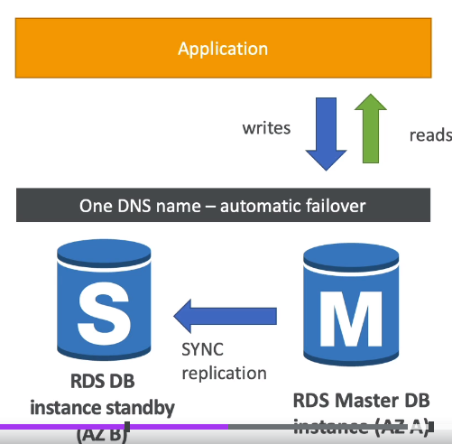

**1. Amazon RDS overview**
- RDS stands for Relation Database Service
- It is managed DB service for DB us SQL as a query language: nó quản lý database service cho database sử dung SQL như một ngôn ngữ truy vấn 
- It allows you to create databases in the cloud that are managed by AWS
  - Postgres
  - Mysql
  - MariaDB
  - Oracle
  - Microsoft SQL server
  - Aurora(AWS Proprietary database - database độc quyền của AWS)

_1.1 Advantage over using RDS versus deploying DB on EC2: Thuận lợi về sử dụng RDS so với triển khai DB trên EC2_
- RDS is managed service:
  - provisioning database is fully Automated , operating system patching is automated: cung cấp cơ sở dữ liệu hoàn toàn tự động, hệ điều hành vá lỗi tự động
  - continuous backup and restore to specific timestamp (point in time restore): sao lưu liên tục và khôi phục được về thời gian chỉ định
  - Monitoring dashboards: bảng điều khiển giám sát
  - read replicas for improved read performance: đọc bản sao để cải thiện hiệu xuất đọc
  - Multi AZ setup for Disaster Recovery : Cấu hình Multi AZ cho khắc phục thảm họa
  - You have maintenance window for upgrades: bạn có cửa sổ bảo trì để nâng cấp
  - scaling capacity (vertical scale and horizontal scale)
  - Storage backend by EBS (gp2 or io1)
- BUT you can't SSH into your instance 

_1.2 RDS backup_

- Backups are automatically enable in RDS: Sao lưu luôn tự động bật trong RDS
- Automated backup:
  - Daily full backup of database (during the maintenance window): hàng ngày tất cả ddaatabase đều được sao lưu (trong cửa sổ bảo trì)
  - Transaction logs are backup by RDS every 5 minutes: Nhật ký giao dịch cũng được RDS sao lưu mỗi 5 phút 1 lần
  => ability to restore to any point in time (from oldest backup to 5 minutes ago): có khả năng khôi phục từ bất kể thời gian điể vào từ lần backup cũ nhất đến 5phút trước
  - 7 days retention (can be increase to 35 days): giữ lại trong 7 ngày - có thể tăng lên là 35 ngày
- DB snapshots
  - manually triggered by the user: kích hoạt thủ công bởi user
  - retention of backup for as long as you want: có thể duy trì snapshots, trong thời gian dài miễn là bạn muôns

_1.3 RDS - Storage Auto Scaling_

- Help you increase storage on your RDS DB instance dynamically: giúp bạn tăng khả năng lưu trữ trên RDS DB instance động
- When RDS detects your running out free database storage, it scales automatically - khi RDS phát hiện, chỗ để hàng free trong database của bạn "cạn kiệt", nó sẽ mở rộng tự động
- Avoid manually scaling your database storage: tránh mở rộng chỗ để hàng trong database bằng tay (thủ công)
- You have to set maximum storage threshold (maximum limit for DB storage) - threshold: ngưỡng

- Automatically modify storage if:
  - Free storage is less than 10% of the allocated storage
  - Low storage lasts least 5 minutes: bộ nhớ thấp kéo dài trong ít nhất 5 phút
  - 6 hours have passed since last modification: 6 giờ đã qua kể từ khi lần thay đổi cuối cùng
- Useful for application with unpredictable workloads: hữu ích cho ứng dụng với khối lượng công việc không thể đoán trước
- Supports all RDS database engines (Postgres, Mysql, MariaDB, Oracle, Microsoft SQL server, Aurora(AWS Proprietary database - database độc quyền của AWS))

**2. RDS Replicas vs RDS Multiple Availability Zone**

_2.1 RDS Read Replicas for read scalability_
- We can create up to 5 Read Replicas
- RDS Read Replicas can read within AZ, Cross AZ, cross Region: RDS Read Replicas có thể đọc trong AZ, xuyên qua AZ khác, xuyên qua Region khác
- Replication is ASYNC (Asynchronous: không đồng bộ) so reads are eventually consistent - Bản sao là không đồng bộ, vì vậy lần đọc cuối cùng nhất quán 
- Replicas can promoted on of "RDS DB instance red replica" to own DB: Bạn có thể thăng cấp "RDS DB instance red replica" thành DB riêng
  - Về ý tưởng khi Main RDS bị lỗi bạn có thể thăng cấp 1  "RDS DB instance red replica" thành main DB, nhưng DB này sẽ không thể nhân rộng lên nữa
  - After promoted "RDS DB instance red replica" don't have mechanism replication: Sau Khi được thăng chức "RDS DB instance red replica" sẽ không có cơ chế nhân rộng nnữa 
- After create replicas: Applications must update the connection string to leverage read replicas: Sau khi tạo ra các bản sao, Ứng dụng phải cập nhật các kết lối đến RDS thành tận dụng các "RDS DB instance read replica"

_2.2 RDS Read Replicas - USE CASES_

- You have production database that is taking on normal load: bạn có production database đang chịu tải bình thường
- You want to run reporting application to run analytics: bạn muốn chạy một reporting application để chạy phân tích
- You create a Read Replica to run the new workload there: bạn tạo Read Replica để chạy khối lượng công việc mới này
- After create Read Replica -> The production application is completely unaffected: Sau khi tạo Read Replicas -> Production Application hoàn toàn không bị ảnh hưởng
- Read Replicas are used for "SELECT" (= read) only kind of statements, (not run INSERT, UPDATE, DELETE)

_2.3 RDS Read Replicas - Network Cost_
- Network Cost: In AWS there is a network cost when data goes from one AZ to another AZ
  Chi phí mạng: trong AWS ở đó phát sinh chi phí mạng khi khi dữ liệu đi từ 1 AZ đến AZ khác
- For RDS Read Replicas within same region (different AZ), you don't pay that FREE : RDS Read Replicas trong cùng 1 region, bạn không cần thanh toán nó miễn phí
- For RDS Read Replicas without region, you need pay cost

_2.4 RDS Multi AZ (Disaster Recovery: Khắc phục sự cố)_

- You have "Main RDS DB instance in AZ-A" and "RDS DB instance standby in AZ-B". When data applications write to "Main RDS DB instance in AZ-A", that changes need to also be replicated to "RDS DB instance standby in AZ-B"
  Bạn có "Main RDS DB instance in AZ-A" and "RDS DB instance standby in AZ-B", Khi ứng dụng thêm dữ liệu vào Main RDS, rằng thay đổi cũng phải được sao chép sang RDS DB dự phòng ("RDS DB instance standby in AZ-B")

- When you have "One DNS name" - Application will talks to "One DNS name"  -> "One DNS name" will automatic app failover to standby RDS: 
  Khi bạn có One DNS name, ứng dụng sẽ nói chuyện với "One DNS name" -> One DNS name sẽ sự động chuyển đổi dự phòng đến "standby RDS"
- When lose entire AZ or we lose the network or instance or storage of Master database (RDS AZ-A) failure => Standby Database (RDS AZ-B) to become Master database
  Khi mất toàn bộ AZ hoặc mất mạng hoặc instance hoặc kho lưu trữ của Master DAtabase (RDS AZ-A) lỗi => Database dự phòng (RDS AZ-B) trở thành master database
- no manual intervention in app: không can thiệp bằng tay vào ứng dụng
- RDS Multi AZ DON'T used for scaling, Standby database is just for standby: RDS Multi AZ không sử dụng cho mở rộng quy mô, Database dự phòng chỉ để dự phòng
- NOTE: The Read Replicas be setup as Multi AZ for Disaster Recovery (DR): Read Replicas được cấu hình trên Multi AZ cho Khắc phục sự cố

_2.5 RDS - From single-AZ to Multi-AZ_

- Zero downtime operation (No need to stop the DB): Không thời gian chết hoạt động (không cần dừng database)
- Just click on "modify" for the database => choose Multiple-AZ
- The following happens internally (theo dõi những hoạt động trong nội bộ)
  - a Snapshot is taken of the MAIN Database
  - a new DB is restored from the snapshot in a new AZ 
  - Synchronization is established between the two database: đồng bộ hóa được thành lập giữa 2 database