**1. Amazon RDS overview**
- RDS stands for Relation Database Service
- It is managed DB service for DB us SQL as a query language: nó quản lý database service cho database sử dung SQL như một ngôn ngữ truy vấn 
- It allows you to create databases in the cloud that are managed by AWS
  - Postgres
  - Mysql
  - MariaDB
  - Oracle
  - Microsoft SQL server
  - Aurora(AWS Proprietary database - database độc quyền của AWS)

_1.1 Advantage over using RDS versus deploying DB on EC2: Thuận lợi về sử dụng RDS so với triển khai DB trên EC2_
- RDS is managed service:
  - provisioning database is fully Automated , operating system patching is automated: cung cấp cơ sở dữ liệu hoàn toàn tự động, hệ điều hành vá lỗi tự động
  - continuous backup and restore to specific timestamp (point in time restore): sao lưu liên tục và khôi phục được về thời gian chỉ định
  - Monitoring dashboards: bảng điều khiển giám sát
  - read replicas for improved read performance: đọc bản sao để cải thiện hiệu xuất đọc
  - Multi AZ setup for Disaster Recovery : Cấu hình Multi AZ cho khắc phục thảm họa
  - You have maintenance window for upgrades: bạn có cửa sổ bảo trì để nâng cấp
  - scaling capacity (vertical scale and horizontal scale)
  - Storage backend by EBS (gp2 or io1)
- BUT you can't SSH into your instance 

_1.2 RDS backup_

- Backups are automatically enable in RDS: Sao lưu luôn tự động bật trong RDS
- Automated backup:
  - Daily full backup of database (during the maintenance window): hàng ngày tất cả ddaatabase đều được sao lưu (trong cửa sổ bảo trì)
  - Transaction logs are backup by RDS every 5 minutes: Nhật ký giao dịch cũng được RDS sao lưu mỗi 5 phút 1 lần
  => ability to restore to any point in time (from oldest backup to 5 minutes ago): có khả năng khôi phục từ bất kể thời gian điể vào từ lần backup cũ nhất đến 5phút trước
  - 7 days retention (can be increase to 35 days): giữ lại trong 7 ngày - có thể tăng lên là 35 ngày
- DB snapshots
  - manually triggered by the user: kích hoạt thủ công bởi user
  - retention of backup for as long as you want: có thể duy trì snapshots, trong thời gian dài miễn là bạn muôns

_1.3 RDS - Storage Auto Scaling_

- Help you increase storage on your RDS DB instance dynamically: giúp bạn tăng khả năng lưu trữ trên RDS DB instance động
- When RDS detects your running out free database storage, it scales automatically - khi RDS phát hiện, chỗ để hàng free trong database của bạn "cạn kiệt", nó sẽ mở rộng tự động
- Avoid manually scaling your database storage: tránh mở rộng chỗ để hàng trong database bằng tay (thủ công)
- You have to set maximum storage threshold (maximum limit for DB storage) - threshold: ngưỡng

- Automatically modify storage if:
  - Free storage is less than 10% of the allocated storage
  - Low storage lasts least 5 minutes: bộ nhớ thấp kéo dài trong ít nhất 5 phút
  - 6 hours have passed since last modification: 6 giờ đã qua kể từ khi lần thay đổi cuối cùng
- Useful for application with unpredictable workloads: hữu ích cho ứng dụng với khối lượng công việc không thể đoán trước
- Supports all RDS database engines (Postgres, Mysql, MariaDB, Oracle, Microsoft SQL server, Aurora(AWS Proprietary database - database độc quyền của AWS))

**2. RDS Replicas vs RDS Multiple Availability Zone**

_2.1 RDS Read Replicas for read scalability_
- We can create up to 5 Read Replicas
- RDS Read Replicas can read within AZ, Cross AZ, cross Region: RDS Read Replicas có thể đọc trong AZ, xuyên qua AZ khác, xuyên qua Region khác
- Replication is ASYNC (Asynchronous: không đồng bộ) so reads are eventually consistent - Bản sao là không đồng bộ, vì vậy lần đọc cuối cùng nhất quán 
- Replicas can promoted on of "RDS DB instance red replica" to own DB: Bạn có thể thăng cấp "RDS DB instance red replica" thành DB riêng
  - Về ý tưởng khi Main RDS bị lỗi bạn có thể thăng cấp 1  "RDS DB instance red replica" thành main DB, nhưng DB này sẽ không thể nhân rộng lên nữa
  - After promoted "RDS DB instance red replica" don't have mechanism replication: Sau Khi được thăng chức "RDS DB instance red replica" sẽ không có cơ chế nhân rộng nnữa 
- After create replicas: Applications must update the connection string to leverage read replicas: Sau khi tạo ra các bản sao, Ứng dụng phải cập nhật các kết lối đến RDS thành tận dụng các "RDS DB instance read replica"

_2.2 RDS Read Replicas - USE CASES_
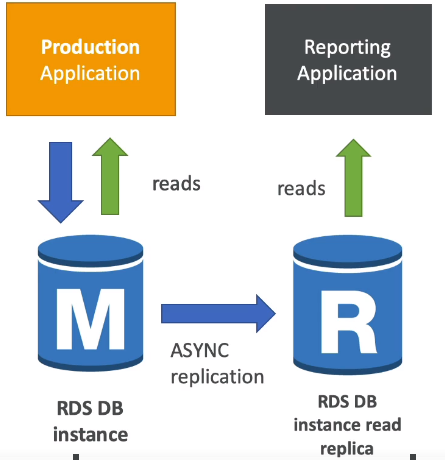
- You have production database that is taking on normal load: bạn có production database đang chịu tải bình thường
- You want to run reporting application to run analytics: bạn muốn chạy một reporting application để chạy phân tích
- You create a Read Replica to run the new workload there: bạn tạo Read Replica để chạy khối lượng công việc mới này
- After create Read Replica -> The production application is completely unaffected: Sau khi tạo Read Replicas -> Production Application hoàn toàn không bị ảnh hưởng
- Read Replicas are used for "SELECT" (= read) only kind of statements, (not run INSERT, UPDATE, DELETE)

_2.3 RDS Read Replicas - Network Cost_
- Network Cost: In AWS there is a network cost when data goes from one AZ to another AZ
  Chi phí mạng: trong AWS ở đó phát sinh chi phí mạng khi khi dữ liệu đi từ 1 AZ đến AZ khác
- For RDS Read Replicas within same region (different AZ), you don't pay that FREE : RDS Read Replicas trong cùng 1 region, bạn không cần thanh toán nó miễn phí
- For RDS Read Replicas without region, you need pay cost

_2.4 RDS Multi AZ (Disaster Recovery: Khắc phục sự cố)_
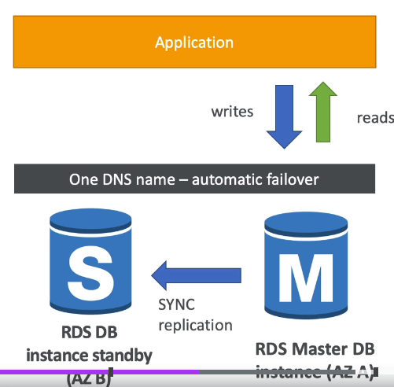
- You have "Main RDS DB instance in AZ-A" and "RDS DB instance standby in AZ-B". When data applications write to "Main RDS DB instance in AZ-A", that changes need to also be replicated to "RDS DB instance standby in AZ-B"
  Bạn có "Main RDS DB instance in AZ-A" and "RDS DB instance standby in AZ-B", Khi ứng dụng thêm dữ liệu vào Main RDS, rằng thay đổi cũng phải được sao chép sang RDS DB dự phòng ("RDS DB instance standby in AZ-B")
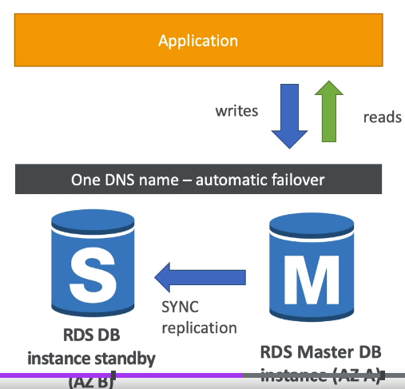
- When you have "One DNS name" - Application will talks to "One DNS name"  -> "One DNS name" will automatic app failover to standby RDS: 
  Khi bạn có One DNS name, ứng dụng sẽ nói chuyện với "One DNS name" -> One DNS name sẽ sự động chuyển đổi dự phòng đến "standby RDS"
- When lose entire AZ or we lose the network or instance or storage of Master database (RDS AZ-A) failure => Standby Database (RDS AZ-B) to become Master database
  Khi mất toàn bộ AZ hoặc mất mạng hoặc instance hoặc kho lưu trữ của Master DAtabase (RDS AZ-A) lỗi => Database dự phòng (RDS AZ-B) trở thành master database
- no manual intervention in app: không can thiệp bằng tay vào ứng dụng
- RDS Multi AZ DON'T used for scaling, Standby database is just for standby: RDS Multi AZ không sử dụng cho mở rộng quy mô, Database dự phòng chỉ để dự phòng
- NOTE: The Read Replicas be setup as Multi AZ for Disaster Recovery (DR): Read Replicas được cấu hình trên Multi AZ cho Khắc phục sự cố

_2.5 RDS - From single-AZ to Multi-AZ_
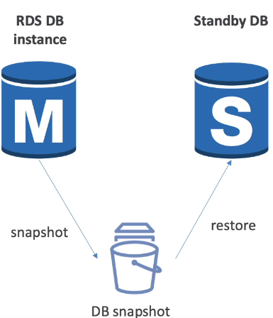
- Zero downtime operation (No need to stop the DB): Không thời gian chết hoạt động (không cần dừng database)
- Just click on "modify" for the database => choose Multiple-AZ
- The following happens internally (theo dõi những hoạt động trong nội bộ)
  - a Snapshot is taken of the MAIN Database
  - a new DB is restored from the snapshot in a new AZ 
  - Synchronization is established between the two database: đồng bộ hóa được thành lập giữa 2 database
  
**3. RDS Encryption + Security**

_3.1 RDS Encryption_
- At rest encryption (Which data not movement) - mã hóa khi nghỉ ngơi (nghĩa là lúc này dữ liệu không di chuyển)
  - Possibility to encrypt the master & read replicas with AWS KMD - AES 256 encryption (possibility: có khả năng)
  - Encryption has to be defined at launch time
  - if the master is not encrypted, the read replicas cannot encrypted
  - Transparent Data Encryption (TDE - Mã hóa dữ liệu minh bạch) available or Oracle and SQL server
- In-Flight encryption
  - SSL certificates to encrypt data to RDS in flight - that mean SSL certificate being encrypted data from client to RDS
  - To enforce SSL: Để bắt buộc có SSL bạn cầu cấu hình
    - PostgresSQL: rds.force_ssl=1 in the AWS RDS console (parameter Group)
    - MySQL: Within the DB
      GRANT USAGE ON ** TO 'mysql_user'@'%' REQUIRE SSL;

- RDS Encryption Operations: hoạt động RDS mã hóa
  - snapshots of un-encrypted RDS database are un-encrypted
  - snapshot of encrypted RDS database are encrypted
  - can copy RDS un-encrypted into an RDS encrypted one: có thể sao chép RDS un-encrypted trở thành RDS encrypted
- To encrypt an un-encrypted RDS database
  - Create a snapshot of the un-encrypted database
  - Copy the snapshot and enable encryption for the snapshot
  - Restore the database from the encrypted snapshot
  - Migrate applications to the new database, and delete the old database: di chuyển ứng dụng đến database mới, xóa database cũ
    
_3.2 RDS Security - Network & IAM_
- Network Security 
  - RDS database are usually deployed within private subnet, not in a public, not expose your database
  - RDS security works by leveraging security group, it controls IP/ security group can communicate with RDS (leveraging: tận dụng, communicate giao tiếp)

- Access management:
  - IAM polices help control who can manage AWS RDS (through the RDS API)
    - who can create database
    - who can read database
    - ...
  - Traditional Username and password can be used to login into the database
  - IAM-based authentication can be used to login into only RDS MySQL & PostgreSQL: Xác thực dựa trên IAM,CHỈ có thể sử dụng đăng nhập vào RDS Mysql & RDS postgresql
- RDS - IAM Authentication
  - IAM database authentication works with ONLY MySQL & PostgreSQL
  - You don't need a password, just an authentication token obtain through IAM & RDS API calls:
  Bạn không cần mật khẩu, chỉ cần token xác thực thông thu được qua gọi IAM & RDS API
  - Auth-token has lifetime of 15 minutes
- Benefit:
  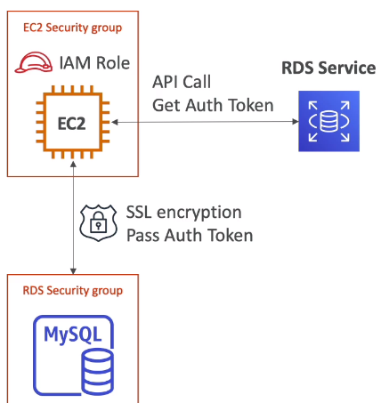
  - Network in/out must be encrypted using SSL
  - IAM to centrally manage users instead of RDS DB: IAM tập chung quản lý người dùng thay vì RDS DB quản lý
  - Can leverage IAM Roles and EC2 instance profiles for easy integration: có thể tận dụng IAM Role và hồ sơ EC2 instance cho dễ dàng hội nhập

**RDS Security SUMMARY**
- Encryption at rest:
  - is done only when you first create the DB instance
  - or: un-encrypted DB => snapshot => copy snapshot as encrypted => create new DB from snapshot encrypted
- Your responsibility: trách nhiệm, nhiệm vụ của bạn
  - Check your port/IP/ security group inbound rule in DB security group
  - in-database user creation and permission or mange through IAM : trong database người dùng tạo quyền và quản lý thông qua IAM
  - Creating a database with or without public access
  - Ensure parameters group or DB is configured to only allow SSL connections
- AWS responsibility: trách nhiệm của AWS
  - no SSH access
  - no manual DB patching: không vá lỗi DB thủ công
  - no manual Operating System (OS) patching: không vá lỗi hệ điều hành thủ công
  - No way to audit the underlying instance: không có cách nào KIỂN TOÁN instance cơ bản

**4. Amazon Aurora**

- Aurora is proprietary technology from AWS (not open sourced): Aurora là công nghệ độc quyền của Amazon (không phải mã nguồn mở)
- Postgres and MySQL are both supported as Aurora DB (that means your drivers will work as if Aurora was a Postgres and Mysql database)
  Postgres và MySql là đều được hỗ trợ bởi Aurora DB( điều này có nghĩa là trình điều khiển của bạn sẽ làm việc như thể Aurora là Postgres and Mysql database)
- Aurora is "AWS cloud optimized" and claims 5x performance improvement over Mysql on RDS, over 3x performance of Postgres on RDS:
  Aurora là "AWS cloud tối ưu hóa" nó tuyên bố cải tiến hiệu suất gấp 5 lần so với Mysql trên RDS, cải tiến hiệu suất gấp 3 lần so với Postgres trên RDS
- Aurora storage automatically grows in increments of 10GB up to 128TB.
- Aurora can have 15 replicas while Mysql has 5, and replication process is faster (sub 10ms replica lag): Aurora có 15 bản sao trong khi Mysqlcó 5. và xử lý nhân rộng rất nhanh (độ chễ bản sao dưới 10ms)
- Failover in Aurora is instantaneous, It is High Availability native. Chuyển đổi dự phòng trong Aurora là ngay lập tức, nó có tính khả dụng cao
- Aurora costs more than RDS (20% more) - but is more efficient: Chi phí của Aurora nhiều hơn RDS 20%, nhưng nó có nhiều hiệu quả hơn

_4.1 Aurora High Availability and Read Scaling_
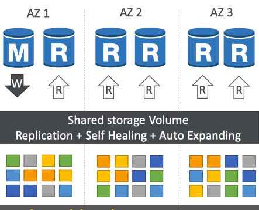
- 6 DATA copies of your data across 3 AZ
  - 4 DATA copies out of 6 needed for writes
  - 3 DATA copies out of 6 needed for reads
  - if some data is corrupted or bad, then Aurora do "self healing peer-to-peer replication": Nếu 1 dữ liệu bị bỏng hoặc tệ sau đó Aurora sẽ tự chữa lành ngang hàng giữa các bản sao
  - Storage rely on 100+ of volumes: kho lưu trữ phụ thuộc vào hàng trăm volumes
- One Aurora instance take responsibility writes (Master): Chỉ có 1 Aurora Master instance  thực hiện nhiệm vụ viết
- When "Aurora Master instance" DON'T work, => THEN Automated failover for Master in less than 30 seconds: Khi "Aurora Master instance" không làm việc, thì sau đó tự động chuyển đổi dự phòng cho Master trong chưa đầy 30 s
- You can have up to 15 Aurora Reads Replicas serve reads: bạn sẽ có lên đến 15 Aurora Reads Replicas serve phục vụ đọc
- If Master fail -> any of there Aurora Reads Replica can become Master: nếu Master lỗi, thì bất kỳ 1 trong số any of there Aurora Reads Replica đều có thể trở thành Master (write)
- Support for Cross Region replication: hỗ trỡ nhân rộng tréo vùng

_4.2 Aurora DB Cluster_
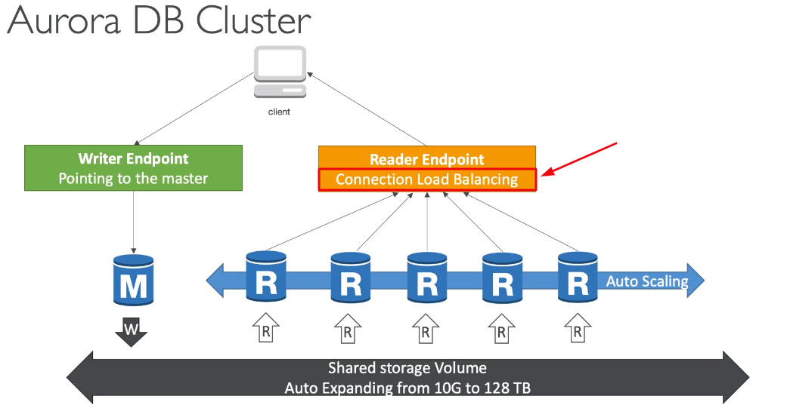

_4.3 Feature of Aurora_
- Automatic fail-over: tự động thất bại - kết thúc
- Backup and recovery: Sao lưu và khắc phục
- Isolation and Security: cách ly và bảo mật
- industry compliance: tuân thủ ngành công nghiệp
- Push-button scaling: nút nhấn mở rộng quy mô
- Automated Patching with zero downtime: vá lỗi tự động với không có thời gian chết
- Advanced monitoring: Giám sát nâng cao
- Routine maintenance: Bảo trì thường xuyên
- Backtrack: restore data at any point of time without using backups

_4.4 Aurora Security_
- similar to RDS because using same engines: tương tự RDS vì sử dụng động cơ, cơ chế tương tự
- Encrypt at rest data using KMS
- Automated backup, snapshots and replicas are also encrypted 
- encryption in flight using SSL (same process RDS Mysql & PostgreSQL)
- Possibility to authenticate using IAM token (same method of RDS)- Possibility : có khả năng
- You are responsible for protecting the instance with security groups: bạn có trách nhiệm bảo vê instance với security groups
- You can't SSH

**5. Amazon Aurora - Advanced concepts**

_5.1 Aurora Auto Scaling_
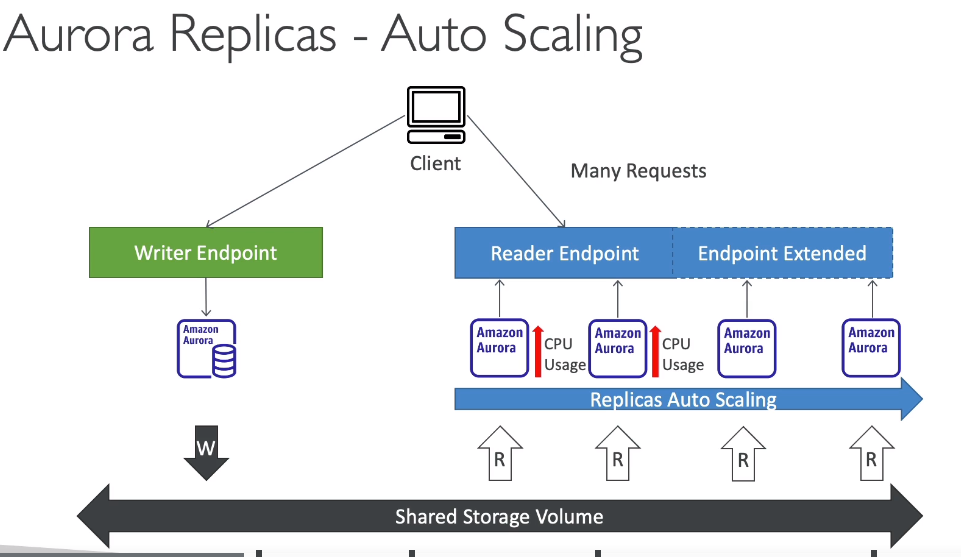

_5.2 Aurora Custom Endpoints_
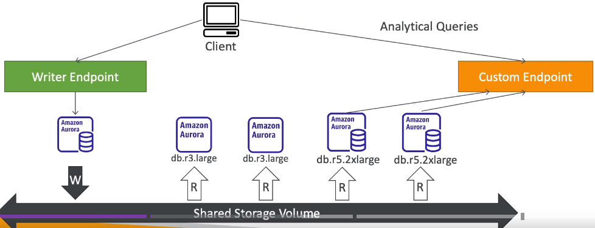
- define a subset of Aurora instance as a Custom Endpoint
- Example: Run analytical queries on specific replicas
- The Reader Endpoint is generally not used after defining Custom Endpoint  

_5.3 Aurora Serverless_
- Automated database instantiation and auto-scaling based on actual usage: Tự động database khởi tạo và tự động mở rộng quy mô dựa trên sử dụng thực tế
- Good for infrequent workload ,intermittent workload or unpredictable workload: tốt cho lượng công việc không thường xuyên, công việc không liên tục và không thể đoán trước khối lượng công việc
- No capacity planning needed: không cần lên kế hoạch trước cho công suất
- Pay per second of Aurora instance is being spun up, can be more cost effective: Chỉ phải thanh toán từ Aurora instance thứ 2 được nó tạo ra, có thể có hiệu quả chi phí hơn rất nhiều

_5.4 Aurora Multi-Master_

- in case you want immediate failover for write node (High Availability): Trong trường hợp bạn muốn ngay tức khắc chuyển đổi dự phòng cho "write data"
- All the nodes in your Aurora Cluster does Read / Write - versus promoting a Read Replica as the new master
  Tất cả các node trong Aurora Cluster đều đọc/viết (=> có Aurora Instance Master <=> read Replica)

_5.5 Global Aurora_
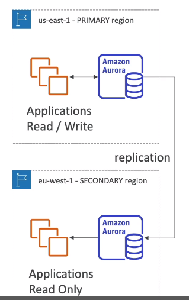
- Aurora Cross Region Read Replicas:
  - Useful for disaster recovery: Hữu ích cho khác phục thảm họa
  - Simple to put place: đơn giản để đặt vào vùng
- Aurora Global Database (Recommended)
  - 1 Primary Region(Read / Write)
  - you can be up to 5 secondary (read-only) regions, replication lag should be in less than 1 second: bạn có thể có tối đa 5 vùng phụ, bản sao chép có độ chễ phải nhỏ hơn 1 giây
  - Up to 16 Read Replicas / secondary region
  - helps for decreasing letancy
  - Promoting another region (for disaster recovery) has an Recovery Time Objective (RTO) of < 1 minute: Thăng cấp Region khác (cho khắc phục sự cố) có thời gian khắc phục khách quan phải nhỏ hơn 1 phút
  - 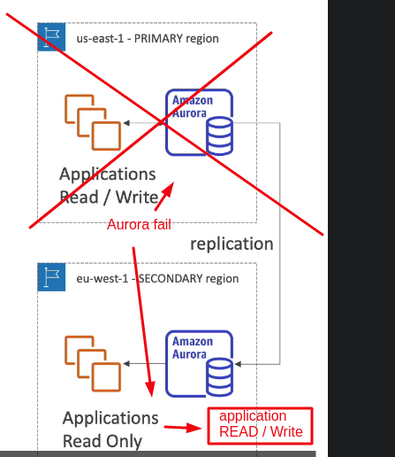

_5.5 Aurora Machine Learning_
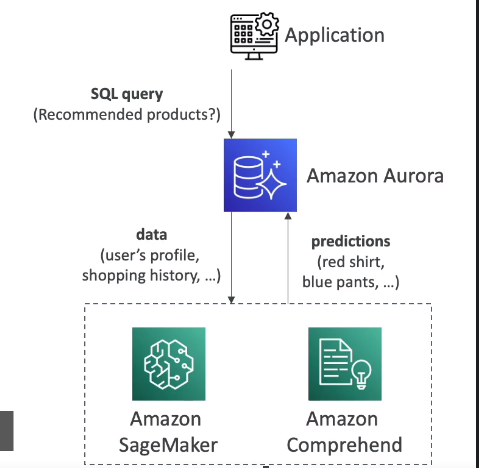
- Enables you to add ML-based predictions to your application via SQL interface: cho phép bạn thêm phỏng đoán MachineLearning-based vào ứng dụng của bạn thông qua SQL 
- Simple, optimized, and secure integration between Aurora and Amazon Machine Learning Service
- Supported service
  - Amazon SageMaker (use within  any kind of Amazon Machine Learning model)
  - Amazon comprehend (for sentiment analysis)
- You don't need to have Machine Learning experience (experience: kinh nghiệm)
- Use cases: fraud detection, ads targeting, sentiment analysis, product recommendations
  Phát hiện gian lân, nhằm mục đích quảng cáo, phân tích ý kiến, giới thiệu sản phầm

**6. Amazon Elastic Cache**
- The same way RDS is to get managed Relation Database...: Tương tự cách RDS quản lý Relation Database
- Elastic Cache is going to help you get managed Redis and Memcached: Elastic Cache đi đến giúp bạn quản lý Redis and Memcached
- Caches are in-memory database with really high performance, low-letancy: Bộ đệm là trong bộ nhớ database với hiệu suất cao, và độ trễ thấp
- Helps reduce load off of database for read intensive workloads: giúp giảm tải cơ sở của dữ liệu cho đọc khối lượng công việc chuyên sâu  
- Helps make your application stateless
- AWS takes care of Operates System maintenance / patching, optimization, setup, configuration, monitoring, failure recovery, and backups
  AWS đảm nhận : bảo trì hệ thống / vá lỗi hệ thống, tối ưu hóa, thiếp lập, cấu hình, giám sát, khắc phục lỗi và sao lưu
- Using Elastic Cache involves heavy application code changes: Using Elastic Cache liên quan đến đổi mã ứng dụng nặng

_6.1 Elastic Cache Solution Architecture - DB cache_
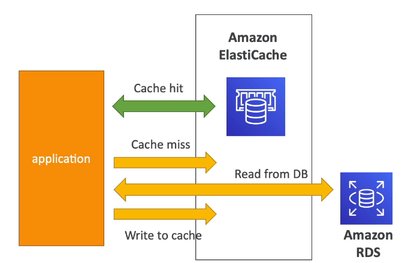
- Application queries to ElastiCache, if not available, get data from RDS and store in ElastiCache
- Application queries to ElastiCache, if "available" => "Cache hit"
- Helps relieve load in RDS: giúp giảm tải cho RDS
- Cache must have a invalidation strategy to make sure only the most current data used in ElastiCache
 Bộ nhớ đệm phải có 1 chiến lược vô hiệu hóa chỉ để chắc chắn (đảm bảo) dữ liệu mới nhất nhất đã được ở trong ElastiCache

_6.2 Elastic Cache Solution Architecture - User Session Store_
- User login into any of the "Instance application"
- The "Instance application" writing session to ElastiCache
- If your user is redirected to another "Instance application" => The instance need retrieve session data directly from ElastiCache the user is already Logged in
  Nếu người dùng của bạn bị chuyển đến 1 Instance application khác => instance cần lấy lại session data trực tiếp từ ElastiCache, User đã đăng nhập rồi

_6.3 Elastic Cache - Redis vs Memcached_
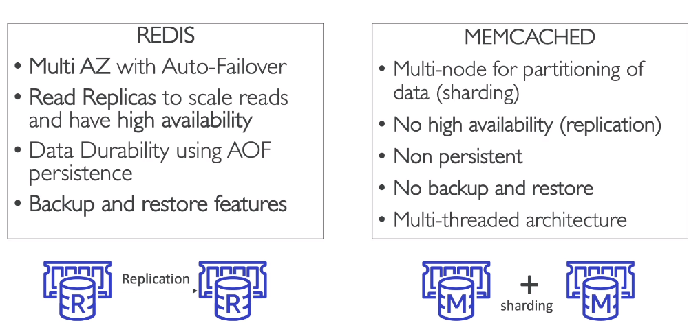
- Redis:
  - Multple AZ with Auto-failover
  - Read Replicas to scale reads and have High Availability
  - Data Durability using AOF persistence: Độ bền của data sử dụng AOF kiên trì
  - Backup and Restore features
- MemCached:
  - Multi-node for partitioning of data (it ís called sharding): Nhiều điểm cho phân vùng của data (nó gọi là Sharding)
  - No High Availability (No Replication)
  - non persistent
  - no backup and restore
  - multi-threaded architecture: kiến trúc đa luồng

***SUMMARY***
- Redis: 
  - High Availability
  - Backup
  - Read Replicas
- MemCached: pure case for distributed: trường hợp thuần túy cho phân phối
  - NO High Availability
  - NO Backup
  - NO Read Replicas

**7. Amazon Elastic Cache - For Solution Architects**

_7.1 Elastic Cache - Cache Security_
- All caches in ElastiCache:
  - Don't suppot IAM authentication
  - IAM policies on ElastiCache are only used for AWS API - level security

- Redis Auth:
  - you can set a "password/token" when you create RedisCluster
  - This is an extra level of security for your cache (on top of security group)
  - support SSL in flight encryption

- Memcached
  - Supports SASL-based authentication(advanced)

_7.2 Patterns for ElastiCache: Mẫu cho ElastiCache_
- Lazy Loading: all the read data is cached, data can become stale in cache: tất cả dữ liệu đọc được đều được cached. data có thể trở lên cũ trong cache
- Write Through: Adds or update data in the cache when written to a DB (no stale data)
  Thêm hoặc cập nhập dữ liêu trong cache khi hoàn thành viết vào DB (dữ liệu không bị cũ)
- Session Store: store temporary session data in a cache (using Time To Live - TTL features)
- Quote: There are only two hard things in computer Science: cache invalidation and naming things
  Trích dẫn: Rằng chỉ có 2 điều khó khăn trong Khoa học máy tính: cache không hợp lệ và đặt tên mọi thứ

_7.2 ElastiCache - Redis use case_
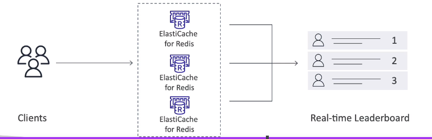
- Gaming Leaderboards are computationally complex: Game xếp hạng người chơi, phức tạp về mặt tính toán
- "Redis Stored sets" guarantee both uniqueness and element ordering: tâp hợp Redis được lưu trữ đảm bảo cả tính duy nhất và thứ tự phần tử
- Each time a new element Added, it is ranked in real time, then added in correct order
  Mỗi khi một phần tử mới được thêm vào, nó được xếp hạng theo thời gian thực, sau đó được thêm vào theo đúng thứ tự
