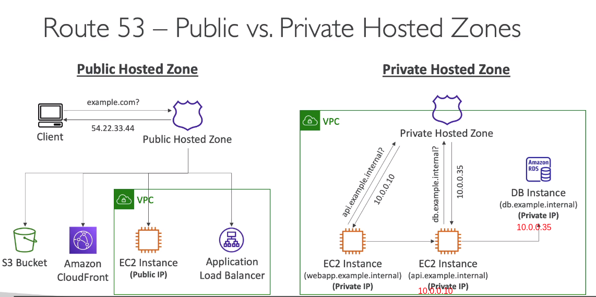
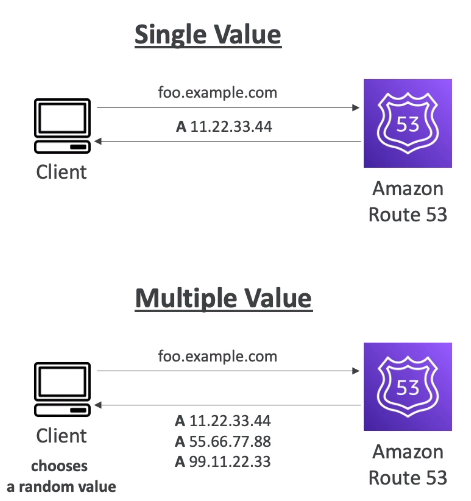
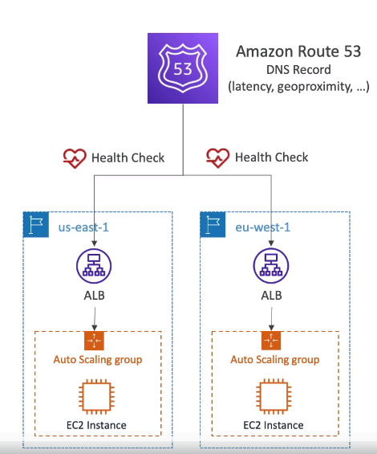
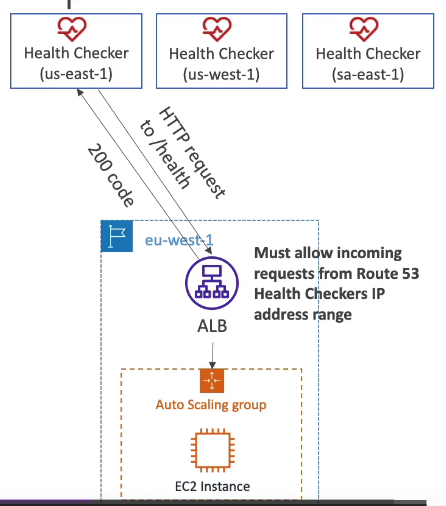
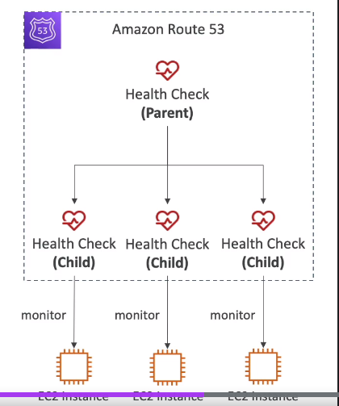
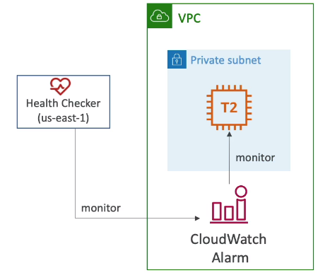
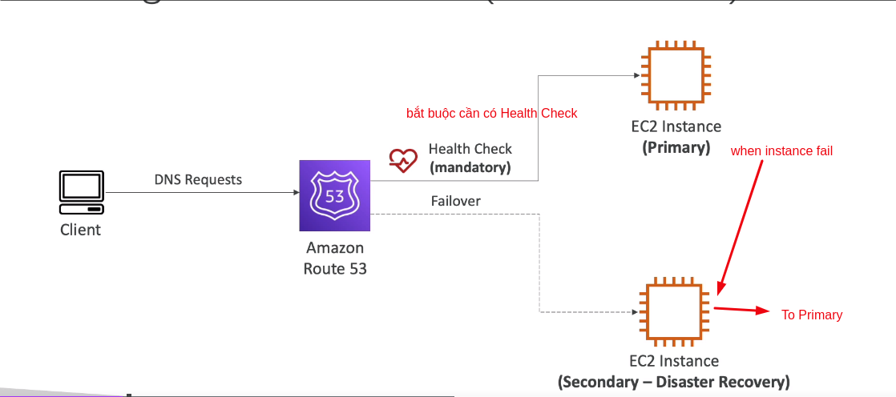
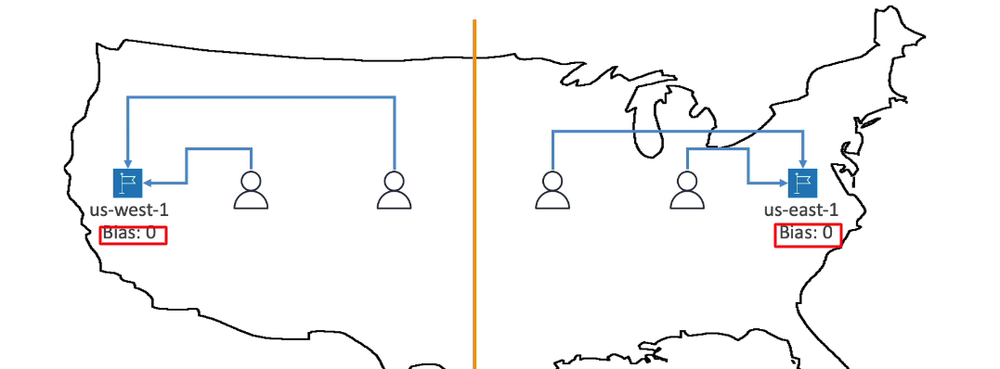
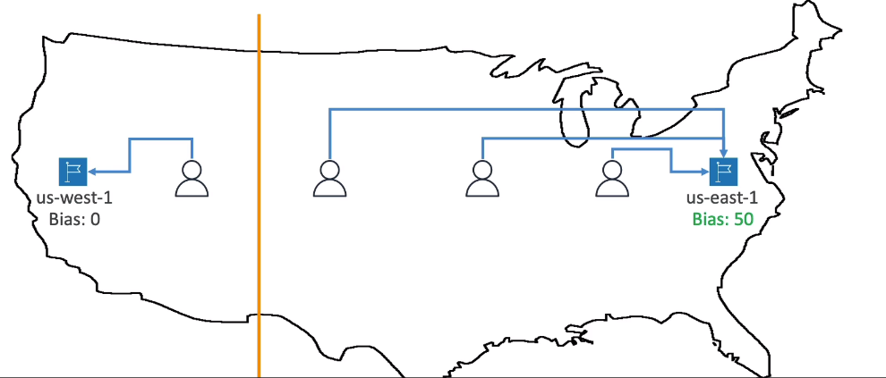

DEMO Following
https://www.youtube.com/watch?v=Hf8wHZ6YUwU

**1. What is DNS**
- DNS stands Domain Name System which translates the human friendly hostnames into the machine IP address
  Hệ thống tên miền cái mà dịch tên máy chủ thân thiện với con người vào trong địa chỉ IP của máy
- www.google.com => 172.17.18.36
- DNS is the backbone of internet (backbone: xương sống)
- DNS uses hierarchical naming structure: DNS sử dụng cấu trúc đặt tên phân cấp

_1.1 DNS Terminologies: một số thuật ngữ_

- Domain registrar: amazon route 52, godaddy...
- DNS record: A, AAAA, CNAME, NS
- Zone file: contain DNS name (this is how to match these host name to IPs: đây là cách ghép đôi tên máy chủ với ip address)
- Name Server: resolves DNS queries (Authoritative or No-Authoritative)
- Top Level Domain (TLD): .com, .use, .in, .gov, .org, ....
- Second Level Domain (SLD): amazon.com, google.com, ....

_1.2 How DNS Work_

**2.Amazon Route 53**
- a High available, scalable, fully managed and Authoritative DNS: Có sẵn cao, mở rộng, quản lý đầy đủ và có thẩm quyền DNS
  - Authoritative = the customer (you) can update the DNS record: Có thẩm quyền nghĩa là bạn có thể cập nhật bản ghi DNS 
- Route 53 is also a Domain Registrar: Route 53 cũng là công ty đăng ký Domain
  - it will e able to register our own domain name there: nó có th  đăng ký domain name riêng của chúng ta tại đây
- Ability to check health of your resources: có khả năng check sức khỏe tài nguyên của bạn
- The only service in AWS provides 100% availability SLA
- Why call Route 53, 53 is a reference to the traditional DNS port: 53 là 1 tham chiếu đến cổng truyền thống của DNS

_2.1 Route 53 - Records_
- Record define How you want to route traffic for a domain: Record định nghĩa cách bạn bạn muốn để định tuyến lưu lượng truy cập cho 1 doamin
- Each record contains:
  - Domain /subdomain Name
  - Record type - e.g A, AAAA, CNAME ....
  - Value - e.g: 12.43.56.78
  - Routing Policy - how Route 53 responds to queries
  - TTL - amount of time the record going to be cached at DNS Resolvers: lương thời gian record được lưu trữ vào bộ nhớ đếm các giải quyết DNS
- Route 53 support the following record type:
  - must know : A, AAAA, CNAME / NS
  - advanced : CAA/ DS / MX /MAPTR /PTR /SOA/TXT/SPF/SRV

_2.1 Route 53 - Records TYPE_
- A: maps a hostname to IPv4
- AAAA: maps a hostname to IPv6
- CNAME: maps a hostname to another hostname
  - The target iss a domain which must have an A or AAAA record
  - Can not create a CNAME record for the top node of a DNS namespace (Zone Apex)
  - Example: you can't create for example.com, but you can create for www.example.com
- CN - Name Servers for Hosted Zone

_2.1 Route 53 - Hosted Zone_

- Hosted Zone are a container for records and they will define how to route traffic to a domain and its subdomains
  Hosted Zone là vùng chứa records và chúng sẽ xác định định tuyến lưu lượng truy cập đến domain hoặc subdomain của nó
- Hosted Zone have 2 type:
  - Public hosted zones: contains records that specific how to route traffic on the internet (public domain name)
    Public hosted zones: chứa records và chúng sẽ xác định định tuyến lưu lượng truy cập trên mạng internet
  - Private hosted zones: contains record that specific how to route traffic within one or more VPCs (private domain name)
    Private hosted zones: chứa records và chúng sẽ xác định định tuyến lưu lượng truy cập bên trong 1 hoặc nhiều VPCs

- You pay $0.5 / month / hosted zone

**3.Amazon Route 53 - TTL (Time To Live)**

- TTL stands Time To Live
- If you set High TTL: (e.g 24 hour)
  - This going to do a lot less traffic to Route53(because the result cached in 24hours): điều này sẽ làm cho ít dữ liệu truy cập hơn đến route53(vì kết quả đã được lưu lại trong bộ nhớ đệm trong 24 giờ)
  - possibly the client will have outdated record (ví dụ domain này không còn trỏ đến ip kia nữa => lỗi)
- If you set Low TTL: (e.g 60s)
  - More traffic on Route53 ($$): This going to do a lot more traffic to Route53 => so a lot more dollar you will to pay for AWS
  - Records are outdated for less time: Records bị lỗi thời sẽ ít hơn
  - easy to change record
- Except for Alias Record, TTL is mandatory for each DNS Record: Ngoài trừ "Alias Record", TTL là bắt buộc đối với mỗi records

**4. CNAME vs Alias**
- AWS Resource (Elastic Load Balancer, CloudFront...) expose an AWS host name
  lb1-1234.us-east-2.elb.amazonaws.com and you want myapp.mydomain.com
- CNAME:
  - Points a hostname to any other hostname. (app.mydomain.com => blabla.anthing.com)
  - Only for non-root Domain (aka.something.mydomain.com)
- Alias:
  - Points a hostname to an AWS Resource (app.mydomain.com => blala.amazonaws.com)
  - Works for Root Domain and non-root domain (aka mydomain.com)
  - free for charge: miễn phí
  - native health check
- Alias Records:
  - Map a hostname to an AWS resource
  - An extension to DNS functionality: một phần mở rộng cho các chức năng của DNS 
  - Alias Records automatically recognizes changes in the resource IP address: tự động phát hiện thay đổi tài nguyên trong địa chỉ IP
  - Unlike CNAME,  Alias Records can be used for  the top node of DNS namespace (Zone Apex), eg: example.com
  Không giống CNAME, Alias Record có thể được sử dụng cho node trên cùng của DNS namespace called the Zone Apex
  - Alias Record is always of type A/ AAAA for AWS resources (ipv4 / ipv6)
  - You can NOT set TTL
- Alias Records Target:
  - Elastic Load Balancers 
  - CloudFront Distributions
  - API Gateway
  - Elastic Beanstalk environments
  - S3 Website
  - VPC interface Endpoint
  - Global accelerator
  - Route53 record in the same hosted zone
  - You can not set a ALIAS record for EC2 DNS name

**5. Route53 - Routing Policies**
- Define how Route 53 responds to DNS queries
- Don't get confused Routing Policies by the word "Routing": Không nhầm lẫn Routing Policies với RRouting-
  - It is NOT the same as Load Balancer routing and the load balancer will routing traffic
  - DNS does not route any traffic (traffic don't through DNS), it only respond to the DNS queries : DNS không định tuyến lưu lượng truy cập, nó chỉ trả lời các truy vấn DNS 
- Route 53 supports the following Routing Policies: Route 53 hỗ trợ Routing Policies sau:
  - Simple: đơn giản
  - Wighted: có trọng số, có trọng lượng
  - Failover: chuyển đổi dự phòng
  - Latency based: dự trên độ trễ
  - Multi-value Answer
  - Geoproximity: địa chỉ gần gũi (using Route 53 flow feature)
  - geolocation: vị trí đia lý

**6. Routing Policies - Simple**

- Typically, route traffic to a single resource: tiêu biểu, định tuyến lưu lượng truy cập đến 1 tài nguyên duy nhất
- Can specify multiple value in the same record: có thể chỉ định nhiều giá trị trong 1 cùng 1 Record
- If multiple value are returned by DNS, Then a random one will be chosen by the client: 
 Nếu nhiều quá trị được trả vể bởi DNS, sau đó ngẫu nhiên 1 sẽ được chọn bởi client
- When Alias enable, specify only one AWS resource
- Can't be associated with Health checks: không thể kết hợp với health check

**7. Routing Policies - Weighted**
- Control the % of the requests that go to each specific resource: Điều khiển % của các request rằng đi đến mỗi một tài nguyên cụ thể
- Assign each record a relative weight: gán mỗi record với một lượng tương đối
  - traffic (%) = (Weight for a specific record) / (Sum of all weights for all records)
  - Weights don't need to sum up to 100
- DNS record must have the same name and same type 
- Can be associated to Health Check: có thể liên kết với Health check
- USE CASE: Load Balancer between regions, test new application version ...
- Assign a Weight of 0 to a Record to stop sending traffic to resource
- if all records have weight set to 0, then all records will be returned equally
  nếu tất cả record có weight là 0 thì tất cả record sẽ được bằng nhau

**8. Routing Policies - Latency-based**
Dựa trên độ trễ
- Redirect to the resource that has least latency close to us: Chuyển hướng đến resource có độ trễ ít nhất và "gần" với chúng ta
- Super helpful when latency for user is a priority: rất hữu ích khi độ trễ cho bạn một quyền ưu tiên
- Latency is based on traffic between users and AWS regions: Độ trễ dựa trên lưu lượng truy cập giữa người dùng và AWS Regions
- Example: Germany users may be directed to the US (if that is the lowest latency): người dùng ở đức có thể đi thẳng thới the US ( nếu ở Germany lowest latency)
- Can be associated with Health Check (has a failorver capability): Có thể  liên kết với health check (có năng lực khôi phục dự phòng)

**9. Routing Policies - Health Checks**

- Http Health Checks are only for public resource
- Health check => Auto DNS failover: Health check
  - Health checks that monitor an endpoint (application, server, other AWS resource): Health check sẽ theo giõi, giám sát 1 điểm cuối
  - Health checks that monitor another health checks: Health check sẽ theo dõi 1 health check khác
  - Health checks that monitor CloudWatch Alarm (full control) - e.g throttles of Dynamo DB, alarm on RDS, custom metrics ... (Helpful for private resource)
    Health checks theo dõi CloudWatch cảnh báo (tất cả điều khiển) - ví dụ điều tiết Dynamo DB, cảnh bảo on RDS, tùy chỉnh số liệu... (hữu ích cho tài nguyên private)
- Health Checks are integrated with CW metrics: Health check tích hợp với CloudWatch với các số liệu

_9.1 Health Checks - Monitor an Endpoint_

- About 15 global health checkers will check the endpoint heath: Khoảng 15 health checkers tòan cầu sẽ kiểm tra sửa khỏe endpoint
  - Healthy / Un-Healthy Threshold 3 default  
  - interval - 30seconds (can set to 10 seconds - higher cost)
  - Support protocol Http, Https, TCP
  - If > 18% of health checker report the endpoint is "Healthy", Route 53 consider it "Healthy", otherwise it is unhealthy
    Nếu lớn hơn 18% người theo dõi sức khỏe báo cáo endpoit là "Healthy", Route53 sẽ xem là "Healthy", nếu không thì "Un-Healthy"
  - Ability to choose which locations you want Route53 to use: Có khả năng chọn địa điểm bạn muốn route53 để sử dụng
- Healthy Checks only pass only when the endpoit respond with the 2xx, 3xx status code
- Health checks can be setup to pass/fail on the text in the first 5120 bytes of the response
  Health checks có thể cài đặt để pass/fail trên 5120 bytes đầu của giá trị text trả về
- Configure you route/firewall to allow Health checks incoming requests from Route53 Health Check: Cấu hình định tuyến/ tường lửa của bạn để cho phép Health checks yêu cầu từ route53 Đến

_9.2 Health Checks - Calculated Health Checks_

- combine the results of multiple Health Checks into a single Health Check: kết hợp kết quả của nhiều Health Checks vào 1 Health Check
- you can define "Partner of all Health Check"
- You can use OR, AND, NOT
- Partner can monitor up to 256 Child Health Check
- Specify how many of the Child Health Checks need to pass to make the Partner pass:
  Chỉ định bao nhiêu của Child Health Checks cần vượt qua để Partner vượt qua
- Use Case: Perform maintenance to your website without causing all health checks to fail: 
  Thực hiện bảo trì website của bạn mà không gây ra tất cả Health Checks lỗi

_9.3 Health Checks - Private Hosted Zone_

- Route53 Health Checks are outside the VPC
- Health Checks can't access private endpoint (private VPC or on-premises ): Health Checks không thể truy cập vào Privete endpoint (Private VPC hoặc tài nguyên trên cơ sở )
- You can Create a ClouldWatch Metric and associate ClouldWatch Alarm, then create Health Checks that checks the alarm itself
  Bạn có thể tạo 1 ClouldWatch Số liệu và kết hợp với ClouldWatch Alarm, sau đó Health Checks kiểm tra cảnh báo của chính nó

**10. Routing Policies - Failover (Active-Passive)**

**11. Routing Policies - Geolocation**
- Different from Latency-based
- This routing is based on user location
- Specify location by Continent, Country or even more precise(the most precise location is going to selected)
  Chỉ định vị trí theo Lục địa, quốc gia hoặc thậm chí còn chính xác hơn (chế độ chính xác địa điểm sẽ được chọn)
- Should create a "Default" record (in case there is no match on location):
  Nên tạo 1 Record mặc định (trong trường hợp này sẽ khong có địa điểm phù hợp thì được chuyển hướng đến đây)
- Use case: website localization, restrict content distribution, load balancing ...
  Trường hợp xử dụng website nội địa, hạn chế phân tán nội dung, cân bằng tải ...
- Can be associated Health Check

**12. Routing Policies - Geoproximity**

- Route traffic to your resource based on the geographic location of users and resource
  Định tuyến lưu lượng truy đến tài nguyên của bạn dựa trên vị trí địa lý của người dùng hoặc tài nguyên
- Ability to shift more traffic to resources based on the define "Bias"
  Có khả năng chuyển nhiều hơn lưu lượng đến tài nguyên, dựa trên xác định "Bias"
- To change the size of the geographic region, specify "Bias" value:
  Để thay đổi kích cỡ của Vùng địa lý, xác định giá trị "Bias"
  - to expand the Bias value (1 to 99) - more traffic to the resource: bạn nhiều giá trị lưu lượng hơn đến resource - mở rông giá trị sai lệch (1 đến 99)
  - to shrink the Bias value (-1 to -99) - less traffic to the resource: bạn ít giá trị lưu lượng hơn đến resource - mở rút lại giá trị sai lệch (-1 đến -99)
- Resources can be:
  - AWS resources (specific AWS region)
  - non-AWS resources (specific Latitude and Longitude) Latitude - vĩ dộ, Longitude - kinh độ
- You must use Route53 Traffic Flow (advanced) to be able to leverage Bias: bạn phải sử dung Route 53 Traffic Flow để có thể tận dụng Bias

_12.1 Traffic Flow_

- Simplify the process of creating and maintaining records in large and complex configurations
 Đơn giản xử lý của tạo mới hoặc bảo trì record trong Cấu hình lớn và phức tạp
- Visual editor to manage complex routing decision trees: trực qian biên tập viên để quản lý định tuyến cây quyết định phức tạp 
- Configuration can be save as Traffic Flow Policies:
  - Can be applied to different Route53 Hosted Zone (Different domain name)

**13.Routing Policies - Multi Value**

- Use when routing traffic to multiple resources
- Route53 return multiple value/resource
- Can be associated with Health Checks (return only value for healthy resource)
- Up to 8 healthy records are returned for each Multi-value query
- Multi-value is not substitute for having an ELB, the idea for Multi Value is the client-side load balancing

**14.  3rd Party & Route 53**
_14.1 Domain Registrar vs DNS Service_

- You buy or register your domain name with a Doamin Registrar typically by paying annual charges (eg. godaddy, amazon registrar inc, ...)
  Bạn có thể mua hoặc đăng ký tên miền của bạn với nhà cung cấp domain tiêu biểu bằng thanh toán chi phí hàng năm
- The Domain Registrar usually provides for you with a DNS Service to manage your DNS record
  The Domain Registrar thường cung cấp cho bạn với 1 DNS Service để quản lý DNS record
- But you can use another DNS service to manage your DNS records

_14.2 3rd Party Registrar with Amazon Route53: Nhà cung cấp thứ 3 với Route53_

- if you buy domain on a 3rd party registrar, you can still use Route53 as the DNS service provider
  - 1 Create Public hosted zone in Route 53
  - 2 Update NS Records on 3rd party website to use Route53 Name Service
- Domain Register != DNS Service
- But every Domain Registrar usually comes with some DNS features