Classic Solution Architecture Discussions : Kiến trúc giải pháp cổ điển

***NOTE***
- stateless application: means application program that does not save client data generated on 1 session for use in the next session with that client
  stateless application nghĩa là chương trình ứng dụng không lưu trữ dữ liệu client đã được tạo trong 1 phiên để sử dụng trong phiên tiếp theo với Client đó

**1. WhatIsTheTime.com**
- WhatIsTheTime.com allows people to know what  time is it
- We don't need a database
- We want to start small and can accept downtime: bạn muốn để bắt đầu nhỏ và có thể chấp nhận thoời gian chết
- Maybe our app will get more and more popular, people really want know the time around the world =>  We want to fully scale vertically and horizontally, no downtime:
    Có thể ứng dụng của chúng ta sẽ càng ngày càng phổ biến, người dùng thực sự muốn biết thời gian xung quanh thế giớ, => chúng ta cáo thể mở rộng tất cả chiều vertically and horizontally, không thời gian chế
- Let is go through the Solutions Architect journey for this app :
    Hãy đi qua những Hnahf trình giải pháp kiến trúc cho ứng dụng này

_1.1 Stateless web app: What time is it?_
- Staring simple
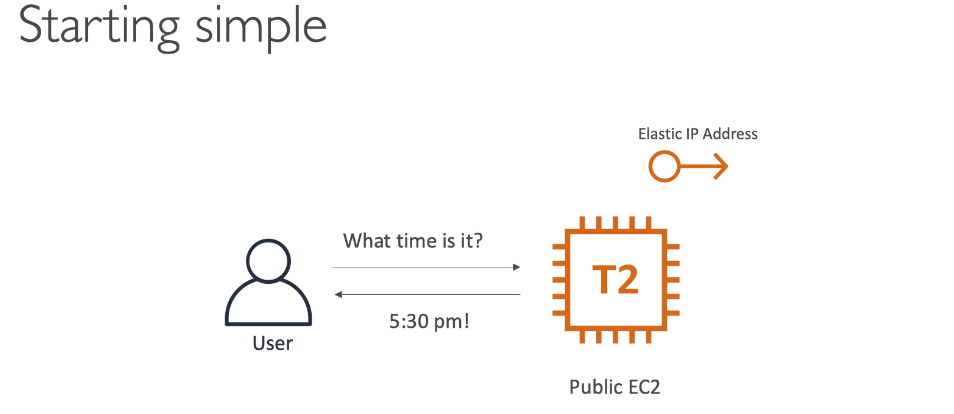

- Scaling Vertically 
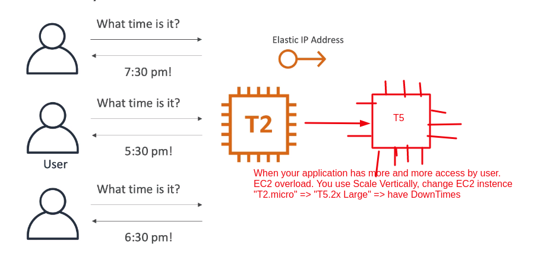

_1.2 Scaling Horizontally_

- 1.Scaling Horizontally
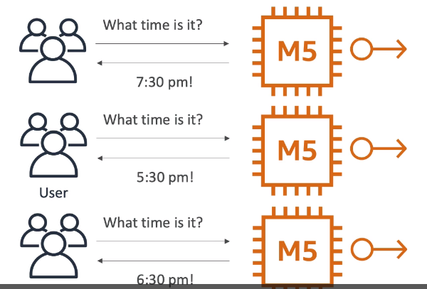
 
=> Problem1: When more and more IPS, then we have to manage more infrastructure - Khi có nhiều EC2 instance lên thì bạn phải quản lý nhiều cơ sở hạ tầng. Đây là 1 bài toán khó

- Resolve Problem1: Then you using Route53 and add "DNS Query for api.whatisthetime.com - Type A Record - TTL: 1hour -> for redirect to EC2 instance"
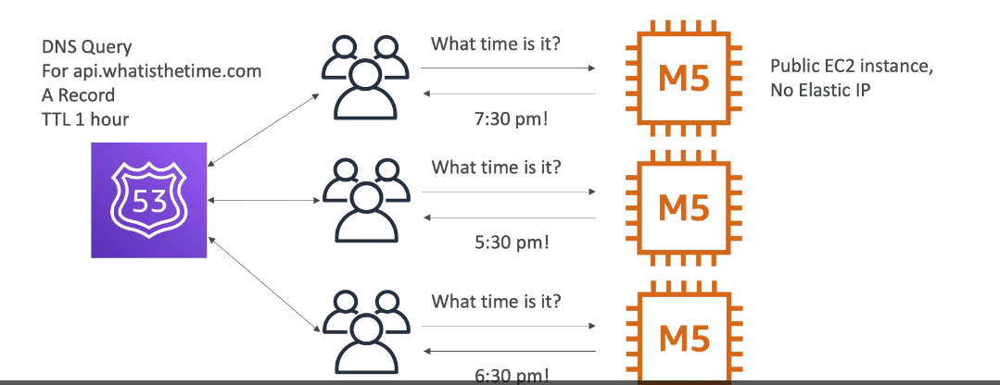

- 2.Scaling Horizontally, adding and removing instance 
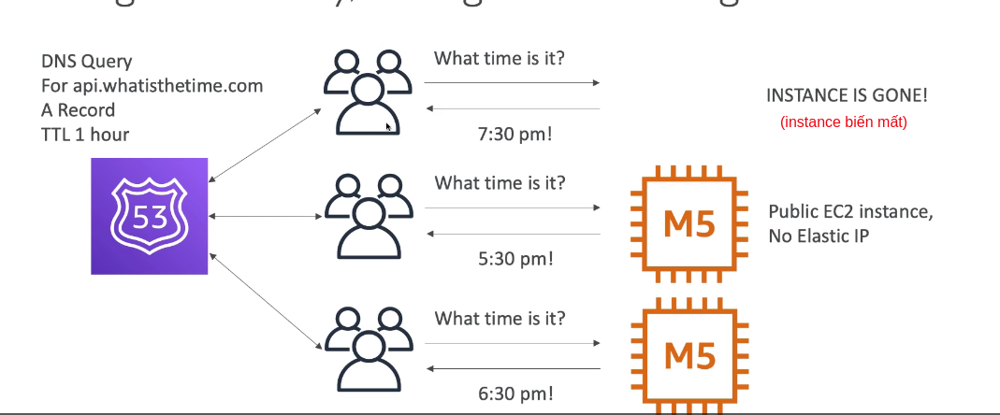

=> Problem2: Because we are setting Time To Live (TTL ) 1hour, Then when scaling, instance is removed users always redirect user to IP of instance is gone (because TTL)
 Vì chúng ta đang cài đătj Time To Live là 1giờ, Sau đó scaling, instance được xóa users luôn luôn truy cập dến IP của instance đã biến mất => Fail

- 3.Scaling Horizontally, with a load balancer + Health Check:  
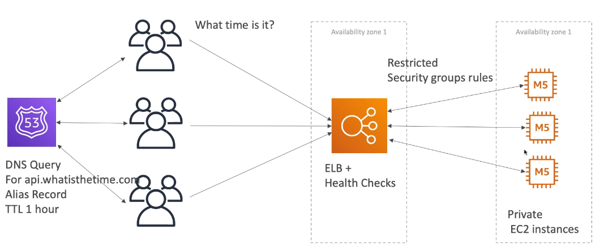
- Resolve Problem2: add Load Balancer + Health Check, LoadBalancer only redirect traffic to instance healthy

=> Problem 3: scaling manually - phải mở rộng truy cập thủ công

- 4.Scaling Horizontally, with an Auto Scaling Group
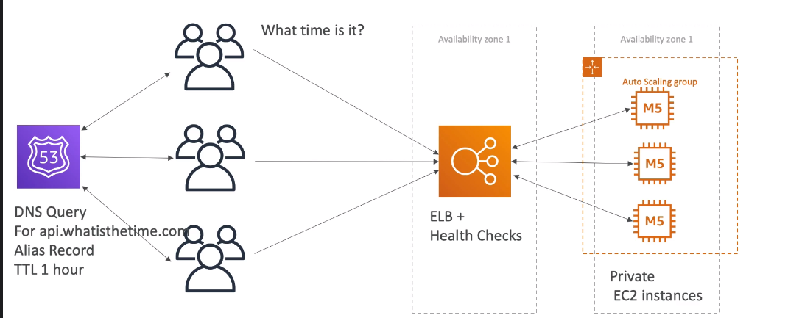

- Resolve Problem3: Add Auto Scaling Group for scale in/ scale out
=> Problem 4: When earthquake Availability Zone down => Our User not happy

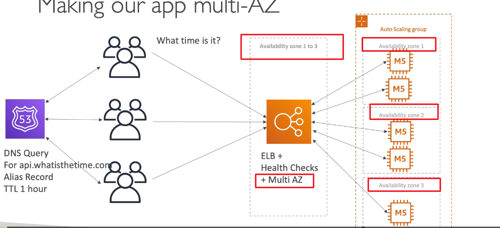

- Resolve Problem4: Making our app Multi-AZ of Load Balancer for disaster recovery: Tạo thêm Multi-AZ của Load Balancer để khắc phục thảm họa

- 5.Scaling Horizontally - Use Reserve capacity
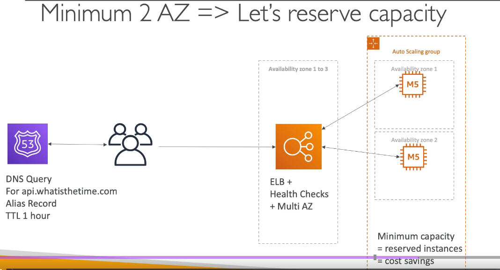

We always have minimum 2 AZ => Let is use Reserve Capacity => For cost saving
Chúng ta luôn luôn có tối thiểu 2 AZ => hãy sử dụng "Reserve Capacity" để tiết kiệm chi phí

_1.3 SUMMARY_
- Public vs Private IP EC2 instance
- Elastic IP vs Route53 vs LoadBalancers
- Route53 TTL, A Records and Alias Record (for use Application Load Balancer)
- Maintaining EC2 instances manually <> Auto Scaling Group
- Multi-AZ to disasters recovery
- ELB Health Checks
- Security Group Rules
- Reservation of capacity for cost-saving when possible

**2. Stateful Web App: MyClothes.com**
- MyClothes.com allow people to buy clothes online
- There shopping cart
- Our website having hundreds of users at the same time
- We need to scale, maintain horizontal scalability and keep our website application as stateless as possible
- Users should not lose their shopping cart: user không nên làm mất giỏ hàng của họ
- Users Should have their details (address, etc) in a database: người dùng nên có chi tiết của họ như address, etc trong 1 database
- Let’s see how we can proceed!: 

_2.1 First process_
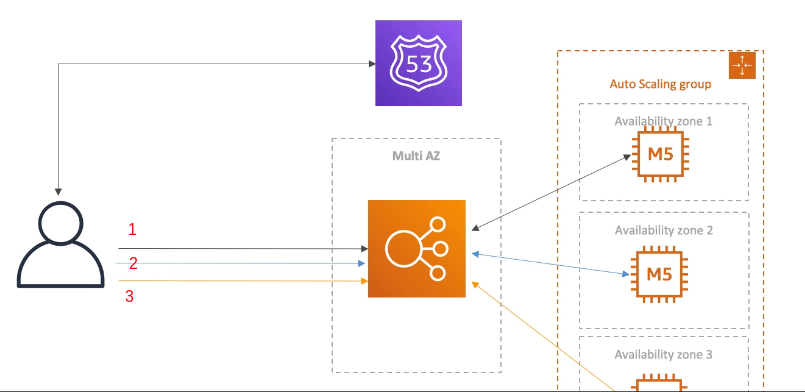

- Problem 1:
  - First request -> Load Balancer redirect to instance 1 (user talk to instance 1) -> user add some stuff to "CART"
  - Second request -> Load Balancer redirect to instance 2 (user talk to instance 2)-> User get all cart, Then user loss cart -> user not happy -> user retry add some stuff to "CART"
  - Third request -> Load Balancer redirect to instance 3 (user talk to instance 3) -> User get all cart, Then user loss cart -> user so angry

_2.2 Introduce Stickiness (Session Affinity: phiên giống nhau)_
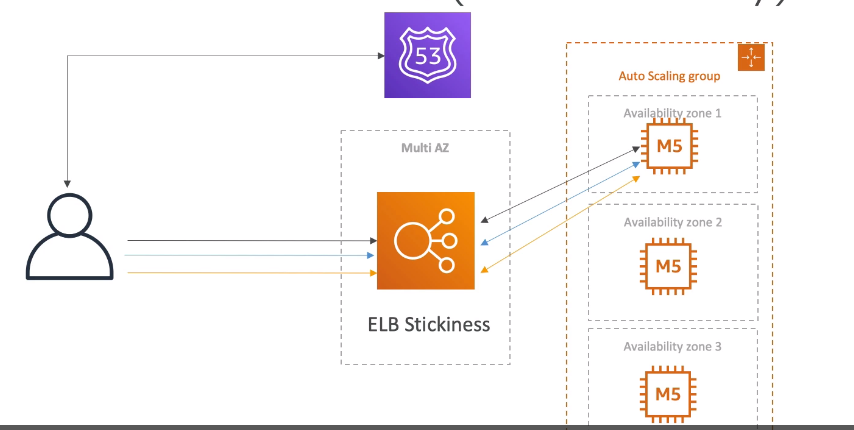

- Resolve Problem 1: Add Stickiness to Load Balancer 
  - First request -> Load Balancer redirect to instance 1 (user talk to instance 1) 
  - Second request -> Load Balancer redirect to instance 1 (user talk to instance 1) : Because Stickines
  - Third request -> Load Balancer redirect to instance 1 (user talk to instance 1) : Because Stickines
- Problem 2: When scaling Instance 1 terminated => Then user loss cart

_2.3 Introduce User Cookies_
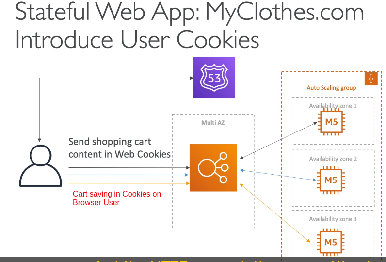

- Resolve Problem 2: Use User Cookies
  - Shopping Cart is saved in storage in User Browser
  - When user add new product to "Cart", then product will going to add to storage in browser
  - shopping cart more and more heavy and Cookies more and more heavy
  - When User connect to Load Balancer then user will send "Shopping Cart" attach to Web cookies

- Problem 3:
  - Http request a heavier (yêu cầu Http sẽ nặng theo thời gian)
  - Security risk: rủi ro về bảo mật
  - cookies can be altered: cookies có thể bị thay đổi
  - Cookies must be validated: Cookies phải được xác nhận 
  - Cookies must be less than 4Kb:  Cookies phải nhỏ hơn 4kb

_2.4 Introduce Server Session_

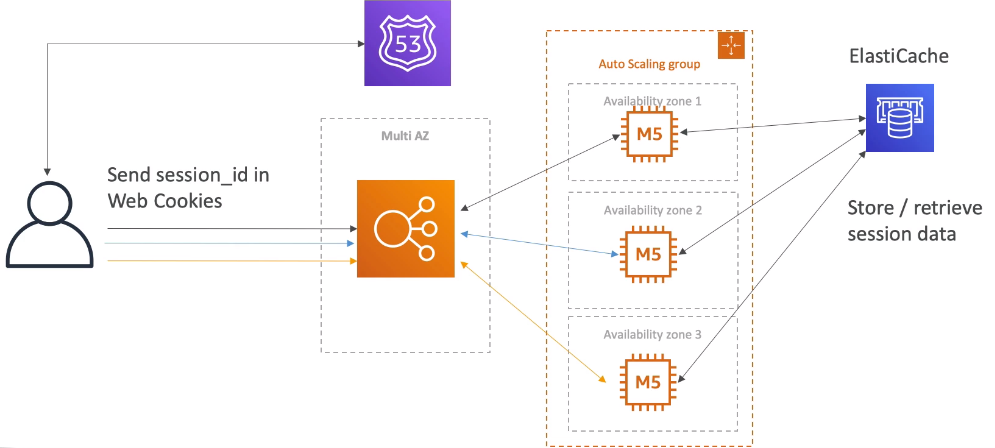

- Resolve Problem 3: Use Server Session - ElastiCache
  - The first request: we are talk to EC2 instance, and say we are going to add product to shopping cart
  - Ec2 instance will add the cart content into the ElastiCache with sessionID
  - When our user basically does the second request with Session_ID and it goes to another EC2 instance => EC2 instance retrieve shopping cart in ElastiCache by Session_ID and response for user 

_2.5 Storing User Data to a Database_

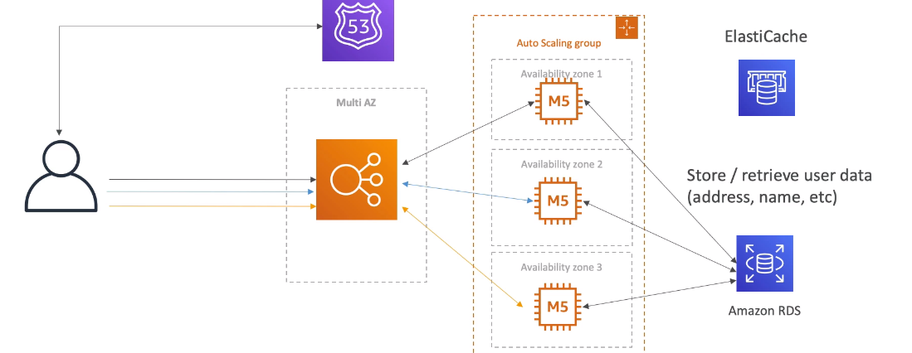

- We want store user data in the database, store user Address
- We gonna talk to our EC2 instance and EC2 instance talk to RDS
- RDS for long term storage and for retrieve user data (address, name, ...)

_2.6 Use Scaling Reads_
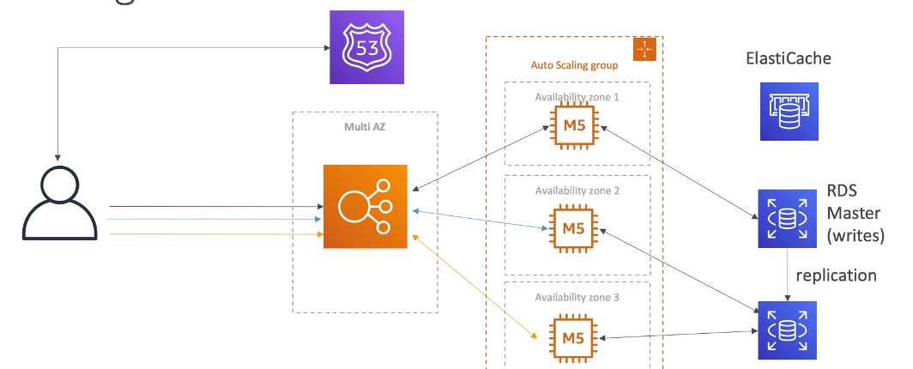

- With request add shopping cart => EC2 instance will talk to RDS Master
- With request READ shopping cart => EC2 instance will talk to RDS Read Replicas

_2.7 Scaling Reads (Alternative: cách khác) - Write through_

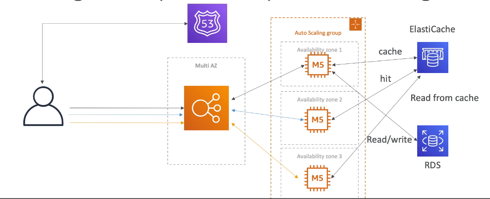

- With request add shopping cart => EC2 instance will talk to RDS, -> Then RDS will respond for EC2 -> EC2 instance will be cached to ElastiCache
- With request READ shopping cart => EC2 instance will talk to ElastiCache (Cache hit)

_2.8 Multi-AZ - Survive disasters_
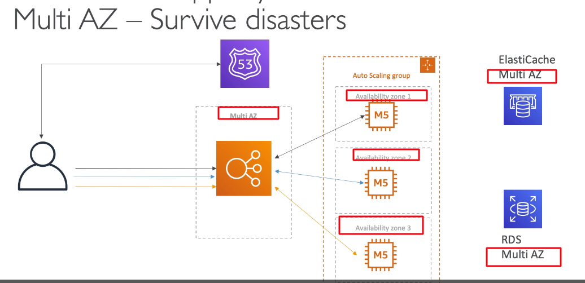

- enable Multi-AZ for Load Balancer 
- enable Multi-AZ for Auto Scaling Group
- enable Multi-AZ for ElastiCache
- enable Multi-AZ for RDS

_2.9 Multi-AZ - Security Group_
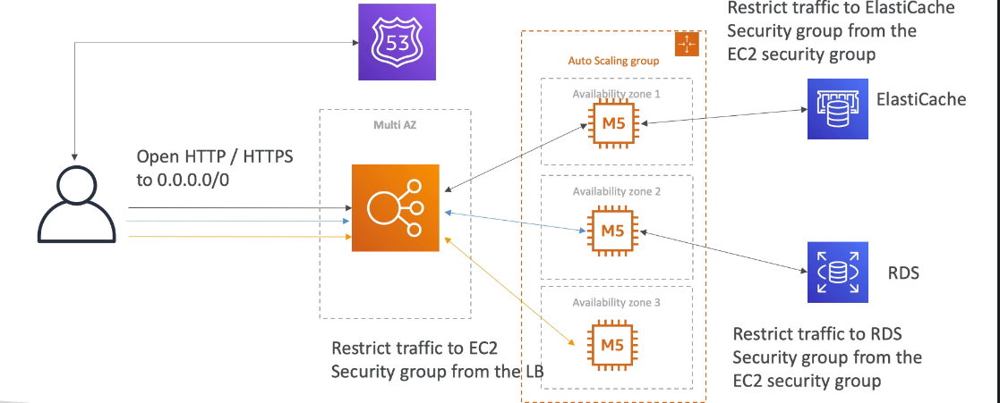

- Allow all traffic HTTP / HTTPS to LoadBalancer
- Restrict traffic to EC2 security group instance from the LoadBalancer
- Restrict traffic to ElastiCache security group from the EC2 security group
- Restrict traffic to RDS security group from the EC2 security group

_2.10 3-tier architectures for web application_
- ELB, ELB sticky sessions
- Web clients for storing cookies and making our web app stateless
- ElastiCache
  - For storing sessions (alternative: DynamoDB)
  - For caching data from RDS
  - Multi-AZ for disaster recovery
- RDS
  - For storing user data
  - Read replicas for scaling reads
  - Multi-AZ for disaster recovery
- Tight Security with security group referencing each other

**3. Stateful Web App: MyWordPress.com**
- We are trying to create a fully scalable WordPress website: chúng ta thử tạo 1 WordPress website có thể mở rộng đầy đủ
- We want that website to access and correctly display picture uploads: Chúng ta muốn rằng website để truy cập và hiển thị chính xác ảnh đã tải lên
- Our user data, and the blog content should be stored in a Mysql database
- Let is how we can achieve this

_3.1 Stateful Web App: MyWordPress.com RDS layer_

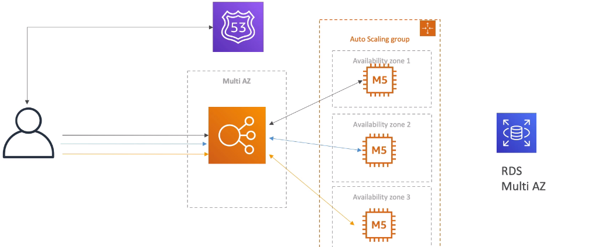

- Using RDS Multi-ZA, ELB Multi-ZA, Auto Scaling Group Multi-ZA

_3.2 Stateful Web App: MyWordPress.com: Scaling with Aurora, Multi-AZ & Read replicas_

- But if j just wanna go and go big an really scale-up => Then i replace  RDS Multi-ZA to "Aurora + Multi-ZA" for upscale

_3.3 Stateful Web App: MyWordPress.com: Storage images with EBS_
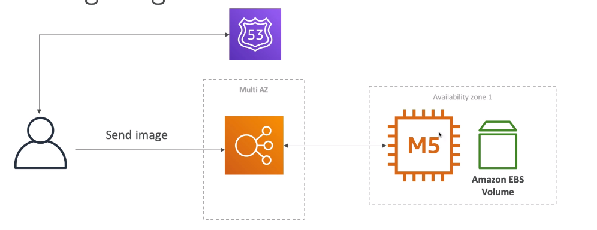
- The very simple solution architecture when we have EC2 instance and has one EBS volume attached to it
- When user send image, user talk to EC2 instance, the EC2 instance strored image to EBS volume
- If we wanted to read the image, image can be read from EBS volume

- When scaling:
  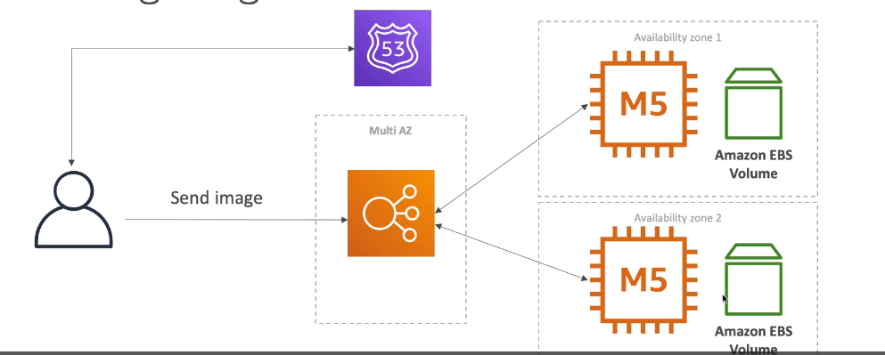
  - you have 2 EC2 instance and 2 EBS volume attached to the same EC2 instance
  - When user send image, user talk to "EC2 instance 1", the "EC2 instance 1" strored image to "EBS volume 1"
  - next request user read image, but use connecting to "EC2 instance 2" and "EC2 instance 2" not find user images

_3.4 Stateful Web App: MyWordPress.com: Storage images with EFS - Elastic File System_

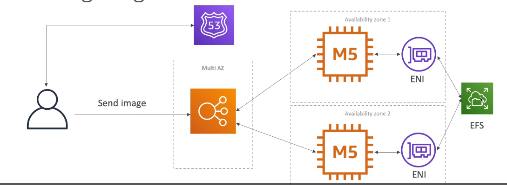

**4. Instantiating Applications quickly: tạo ra ứng dụng nhanh chóng**
- When launching a full stack (EC2, EBS, RDS), it can take time to: Khi ra mắt 1 ngăn xếp đầy (EC2, EBS, RDS), nó cần mất thời gian để
  - install applications
  - insert initial (or recovery) data: thêm vào dữ liệu khởi vạo hoặc khôi phục dữ liệu 
  - Config everything: cấu hình mọi thứ
  - Launch the application

- we can take advantage of the cloud to speed that uo
  Banj có thể tận dụng cloude để tăng tốc độ

_4.1 Ec2 instances_
- Use a Golden AMI (Amazon machine image): Install your applications, OS dependencies ... beforehand and launch your EC2 instance from Golden AMI
- Bootstrap using user data: for dynamic  configuration, use User Data scripts
  Bootstrap sử dụng user data: cho linh hoạt cấu hình, sử dụng User Data script
- Hybir: mix Golden AMI and User Data (Elastic Beanstalk)

_4.2 RDS Database_
- Restore form a snapshot: the database will have schemas and data ready
  Khôi phục từ 1 snapshot, database sẽ có lược đồ và data sẵn snagf

_4.3 EBS Volumes_
 - Restore form a snapshot: the disk will already be formatted and have data:
   Restore từ snapshot: ổ đĩa sẽ luôn sẵn sàng được định dạng và có dữ liệu

**5. Elastic BeanStalk overview**
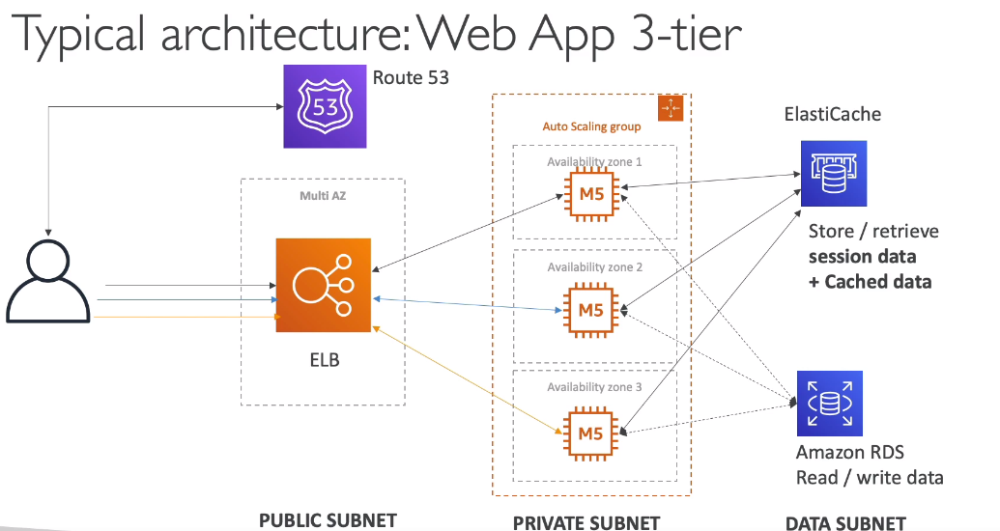

_5.1 Developer Problems on AWS_
- managing infrastructure 
- Deploying code
- configuring all the databases, load balancer ...
- scaling concern : lo lắng đến mở rộng quy mô
- Most web applications have same architecture  (ALB + ASG)
- all the developers want is for their code to run
- possibly, consistently across different applications and environments: 
  Có thể, nhất quán trên ứng dụng và môi trường khác nhau

_5.2 Elastic BeanStalk overview_
- Elastic Beanstalk is a developer centric view of deploy an application on AWS:
  Elastic Beanstalk là quan điểm, góc nhìn  1 một nhà phát triển vào triển khai 1 ứng dụng trên AWS
- It uses all the components we have seen before: EC2, ASG, ELB, RDS: nó sử dụng tất cả các thành phần chúng ta đã được xem trước đó Ec2...
- Managed Service
  - Automatically handles capacity provisioning, load balancing, scaling, application, health monitoring, instance configuration ...
  Tự động hóa xử xý năng lực cung cấp, cân bằng tải, mở rộng quy mô, theo dõi sức khỏe ứng dụng, cấu hình instance
  - Just the application code is responsibility of the developer
    Chỉ code ứng dụng và trách nhiệm duy nhất của developer
  - we still have full control over the configuration: chúng ta còn điều khiển tất cả về cấu hình
  - Beanstalk is free but you need pay for the underlying instances (ELB, ESG)
    Beanstalk kà miễn phí nhưng phải phải trả phí cho các thành phần cơ bản như ELB. ESG

_5.2 Elastic BeanStalk component_
- Application: collect off Elastic Beanstalk components (environments, versions, configurations...)
- Application version: an iteration of your application code
- Environment:
  - Collection of AWS resources running an application version (only one application version at a time)
  - Tier: we can have 2 different tier in Beanstalk
    - Web server environment tier
    - Worker Environment tier
  - you can create multiple environments (dev, test, production)
- Process create an application:
 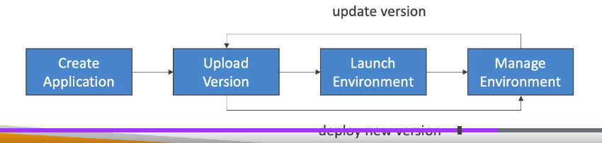
- [Create application] -> [Upload version] -> [Launch Environment] -> [Manage Environment] 

- ElasticBeanstalk support platforms:
  - Go 
  - java SE
  - java with Tomcat
  - .Net core on Linux
  - .Net core on Window server
  - Node js
  - php
  - python
  - ruby
  - packer builder
  - single container docker
  - Multi container docker
  - Preconfigured docker
  - if not supported, you can write your custom platform (advanced)

_5.3 Web service environment tier and Worker Environment Tier_

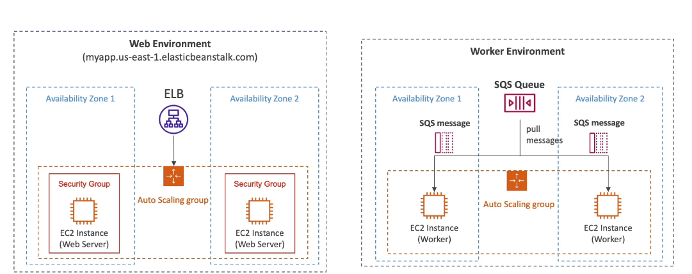

- Worker Environment Tier: 
  - scale based on the number of SQS Queue Messages
  - Can push messages to SQS queue from "Web service environment tier"