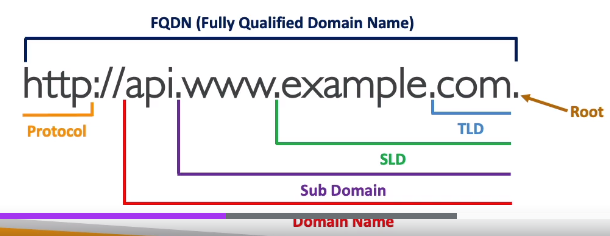
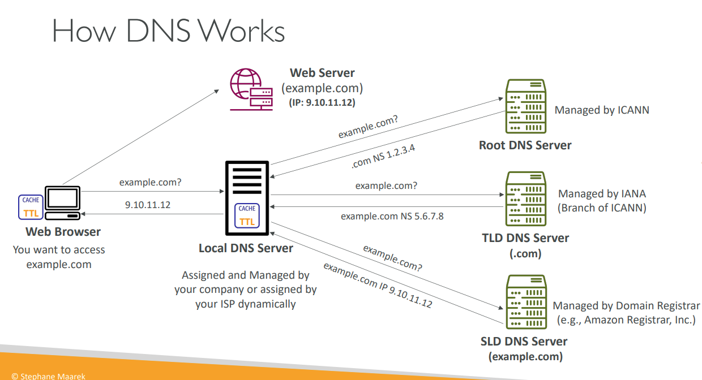
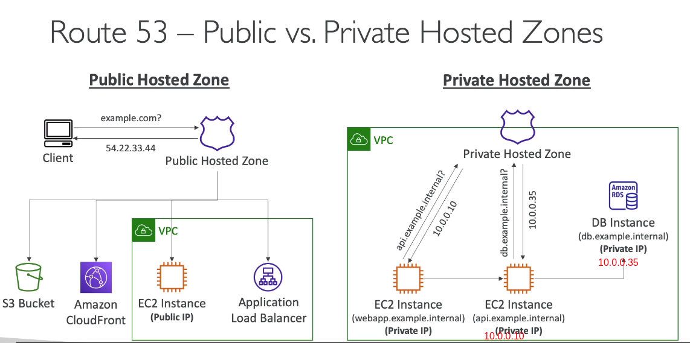
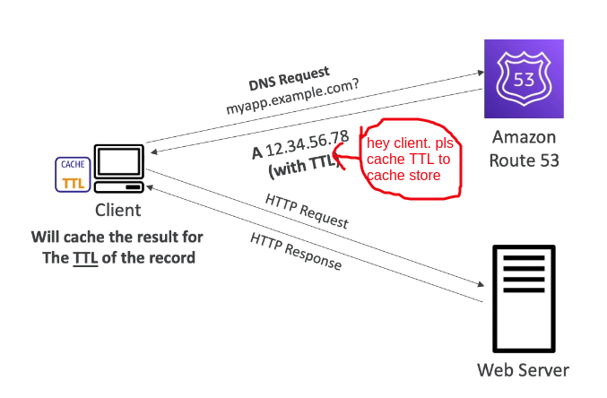
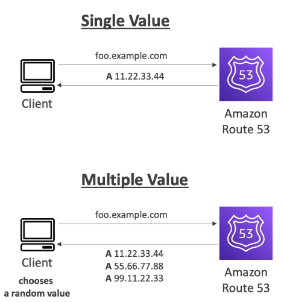

DEMO Following
https://www.youtube.com/watch?v=Hf8wHZ6YUwU

**1. What is DNS**
- DNS stands Domain Name System which translates the human friendly hostnames into the machine IP address
  Hệ thống tên miền cái mà dịch tên máy chủ thân thiện với con người vào trong địa chỉ IP của máy
- www.google.com => 172.17.18.36
- DNS is the backbone of internet (backbone: xương sống)
- DNS uses hierarchical naming structure: DNS sử dụng cấu trúc đặt tên phân cấp

_1.1 DNS Terminologies: một số thuật ngữ_

- Domain registrar: amazon route 52, godaddy...
- DNS record: A, AAAA, CNAME, NS
- Zone file: contain DNS name (this is how to match these host name to IPs: đây là cách ghép đôi tên máy chủ với ip address)
- Name Server: resolves DNS queries (Authoritative or No-Authoritative)
- Top Level Domain (TLD): .com, .use, .in, .gov, .org, ....
- Second Level Domain (SLD): amazon.com, google.com, ....

_1.2 How DNS Work_

**2.Amazon Route 53**
- a High available, scalable, fully managed and Authoritative DNS: Có sẵn cao, mở rộng, quản lý đầy đủ và có thẩm quyền DNS
  - Authoritative = the customer (you) can update the DNS record: Có thẩm quyền nghĩa là bạn có thể cập nhật bản ghi DNS 
- Route 53 is also a Domain Registrar: Route 53 cũng là công ty đăng ký Domain
  - it will e able to register our own domain name there: nó có th  đăng ký domain name riêng của chúng ta tại đây
- Ability to check health of your resources: có khả năng check sức khỏe tài nguyên của bạn
- The only service in AWS provides 100% availability SLA
- Why call Route 53, 53 is a reference to the traditional DNS port: 53 là 1 tham chiếu đến cổng truyền thống của DNS

_2.1 Route 53 - Records_
- Record define How you want to route traffic for a domain: Record định nghĩa cách bạn bạn muốn để định tuyến lưu lượng truy cập cho 1 doamin
- Each record contains:
  - Domain /subdomain Name
  - Record type - e.g A, AAAA, CNAME ....
  - Value - e.g: 12.43.56.78
  - Routing Policy - how Route 53 responds to queries
  - TTL - amount of time the record going to be cached at DNS Resolvers: lương thời gian record được lưu trữ vào bộ nhớ đếm các giải quyết DNS
- Route 53 support the following record type:
  - must know : A, AAAA, CNAME / NS
  - advanced : CAA/ DS / MX /MAPTR /PTR /SOA/TXT/SPF/SRV

_2.1 Route 53 - Records TYPE_
- A: maps a hostname to IPv4
- AAAA: maps a hostname to IPv6
- CNAME: maps a hostname to another hostname
  - The target iss a domain which must have an A or AAAA record
  - Can not create a CNAME record for the top node of a DNS namespace (Zone Apex)
  - Example: you can't create for example.com, but you can create for www.example.com
- CN - Name Servers for Hosted Zone

_2.1 Route 53 - Hosted Zone_

- Hosted Zone are a container for records and they will define how to route traffic to a domain and its subdomains
  Hosted Zone là vùng chứa records và chúng sẽ xác định định tuyến lưu lượng truy cập đến domain hoặc subdomain của nó
- Hosted Zone have 2 type:
  - Public hosted zones: contains records that specific how to route traffic on the internet (public domain name)
    Public hosted zones: chứa records và chúng sẽ xác định định tuyến lưu lượng truy cập trên mạng internet
  - Private hosted zones: contains record that specific how to route traffic within one or more VPCs (private domain name)
    Private hosted zones: chứa records và chúng sẽ xác định định tuyến lưu lượng truy cập bên trong 1 hoặc nhiều VPCs

- You pay $0.5 / month / hosted zone

**3.Amazon Route 53 - TTL (Time To Live)**

- TTL stands Time To Live
- If you set High TTL: (e.g 24 hour)
  - This going to do a lot less traffic to Route53(because the result cached in 24hours): điều này sẽ làm cho ít dữ liệu truy cập hơn đến route53(vì kết quả đã được lưu lại trong bộ nhớ đệm trong 24 giờ)
  - possibly the client will have outdated record (ví dụ domain này không còn trỏ đến ip kia nữa => lỗi)
- If you set Low TTL: (e.g 60s)
  - More traffic on Route53 ($$): This going to do a lot more traffic to Route53 => so a lot more dollar you will to pay for AWS
  - Records are outdated for less time: Records bị lỗi thời sẽ ít hơn
  - easy to change record
- Except for Alias Record, TTL is mandatory for each DNS Record: Ngoài trừ "Alias Record", TTL là bắt buộc đối với mỗi records

**4. CNAME vs Alias**
- AWS Resource (Elastic Load Balancer, CloudFront...) expose an AWS host name
  lb1-1234.us-east-2.elb.amazonaws.com and you want myapp.mydomain.com
- CNAME:
  - Points a hostname to any other hostname. (app.mydomain.com => blabla.anthing.com)
  - Only for non-root Domain (aka.something.mydomain.com)
- Alias:
  - Points a hostname to an AWS Resource (app.mydomain.com => blala.amazonaws.com)
  - Works for Root Domain and non-root domain (aka mydomain.com)
  - free for charge: miễn phí
  - native health check
- Alias Records:
  - Map a hostname to an AWS resource
  - An extension to DNS functionality: một phần mở rộng cho các chức năng của DNS 
  - Alias Records automatically recognizes changes in the resource IP address: tự động phát hiện thay đổi tài nguyên trong địa chỉ IP
  - Unlike CNAME,  Alias Records can be used for  the top node of DNS namespace (Zone Apex), eg: example.com
  Không giống CNAME, Alias Record có thể được sử dụng cho node trên cùng của DNS namespace called the Zone Apex
  - Alias Record is always of type A/ AAAA for AWS resources (ipv4 / ipv6)
  - You can NOT set TTL
- Alias Records Target:
  - Elastic Load Balancers 
  - CloudFront Distributions
  - API Gateway
  - Elastic Beanstalk environments
  - S3 Website
  - VPC interface Endpoint
  - Global accelerator
  - Route53 record in the same hosted zone
  - You can not set a ALIAS record for EC2 DNS name

**5. Route53 - Routing Policies**
- Define how Route 53 responds to DNS queries
- Don't get confused Routing Policies by the word "Routing": Không nhầm lẫn Routing Policies với RRouting-
  - It is NOT the same as Load Balancer routing and the load balancer will routing traffic
  - DNS does not route any traffic (traffic don't through DNS), it only respond to the DNS queries : DNS không định tuyến lưu lượng truy cập, nó chỉ trả lời các truy vấn DNS 
- Route 53 supports the following Routing Policies: Route 53 hỗ trợ Routing Policies sau:
  - Simple: đơn giản
  - Wighted: có trọng số, có trọng lượng
  - Failover: chuyển đổi dự phòng
  - Latency based: dự trên độ trễ
  - Multi-value Answer
  - Geoproximity: địa chỉ gần gũi (using Route 53 flow feature)
  - geolocation: vị trí đia lý

**6. Routing Policies - Simple**

- Typically, route traffic to a single resource: tiêu biểu, định tuyến lưu lượng truy cập đến 1 tài nguyên duy nhất
- Can specify multiple value in the same record: có thể chỉ định nhiều giá trị trong 1 cùng 1 Record
- If multiple value are returned by DNS, Then a random one will be chosen by the client: 
 Nếu nhiều quá trị được trả vể bởi DNS, sau đó ngẫu nhiên 1 sẽ được chọn bởi client
- When Alias enable, specify only one AWS resource
- Can't be associated with Health checks: không thể kết hợp với health check